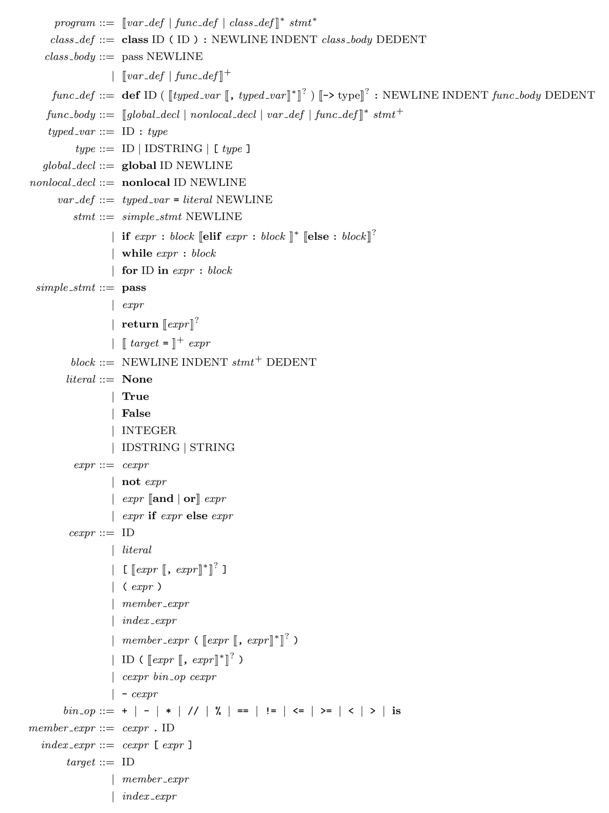

# Programing Assignment I 文档

<!-- TOC -->

- [Programing Assignment I 文档](#programing-assignment-i-文档)
  - [0. 基础知识](#0-基础知识)
    - [0.1 Python3词法](#01-python3词法)
    - [0.2 FLEX简单使用](#02-flex简单使用)
  - [0.4 ChocoPy 语法](#04-chocopy-语法)
      - [ChocoPy 语法](#chocopy-语法)
    - [0.4 BISON简单使用](#04-bison简单使用)
      - [思考题](#思考题)
    - [0.5 Bison 和 Flex 的关系](#05-bison-和-flex-的关系)
  - [1. 实验要求](#1-实验要求)
    - [主要工作](#主要工作)
    - [提示](#提示)
    - [1.1 目录结构](#11-目录结构)
    - [1.2 Bonus](#12-bonus)
    - [1.2 编译、运行和验证](#12-编译运行和验证)
    - [1.3 提供可用的测试用例](#13-提供可用的测试用例)
    - [1.4 评分](#14-评分)

<!-- /TOC -->

## 0. 基础知识

在本次实验中我们讲重点用到`FLEX`，`BISON`和以`Python3.6`为基础改编的`Chocopy`语言。这里对其进行简单介绍。

### 0.1 Python3词法

`ChocoPy`是Python语言的一个子集，不包含`asyncio`，装饰器，`yield`及`raise`语意，该语言的语法在伯克利 [网站](https://chocopy.org/)
有详细介绍，它可以很容易地被编译到RISC-V这样的目标上。该语言使用正式的语法、类型规则和操作语义进行了全面的规定。ChocoPy是由Rohan Padhye和Koushik Sen设计的，Paul
Hilfinger也做出了很大贡献。你可以在 [这里](https://chocopy.org/chocopy_language_reference.pdf)
找到这个语言的定义。伯克利提供的用java版本的文档在[这](./doc/berkeley)

1. 关键字

  ```
  False,None,True,and,as,assert,async,await,break,class,continue,
  def,del,elif,else,except,finally,for,from,global,if,import,in,
  is,lambda,nonlocal,not,or,pass,raise,return,try,while,with,yield
  ```

2. 专用符号

  ```
  + - * // % < > <= >= == != = ( ) [ ] , :  .  ->
  ```

3. 标识符ID和整数NUM，通过下列正则表达式定义，最大 Int 为 $2^{31}−1$

  ```
  letter = a|...|z|A|...|Z
  digit = 0|...|9
  ID = letter+
  INTEGER = digit+
  ```

4. 注释用`#`表示

  ```
  #
  ```

5, String Literal

$$\begin{array}{ll}\text { Literal } & \text { Value } \\ \text { "Hello" } & \text { Hello } \\ \text { "He}\backslash\text{"
ll}\backslash\text{"o" } & \text { He"ll"o } \\ \text { "He}\backslash\backslash\text{"llo" } & \text { He}\backslash\text{"llo } \\ \text
{ "Hell}{\backslash}\text{o" } & \text { (error: "\\o" not recognized) }\end{array}$$

- 注：`[`,  `]` 是分开的token。`[1]`中间不得有空格。
    - `a[1]`应被识别为四个token: `a`, `[`, `1`, `]`

### 0.2 FLEX简单使用

`FLEX`是一个生成词法分析器的工具。利用`FLEX`，我们只需提供词法的正则表达式，就可自动生成对应的C代码。整个流程如下图：


首先，`FLEX`从输入文件`*.lex`或者`stdio`读取词法扫描器的规范，从而生成C代码源文件`lex.yy.c`。然后，编译`lex.yy.c`并与`-lfl`库链接，以生成可执行的`a.out`。最后，`a.out`
分析其输入流，将其转换为一系列token。

我们以一个简单的单词数量统计的程序wc.l为例:

```c
%{
//在%{和%}中的代码会被原样照抄到生成的lex.yy.c文件的开头，您可以在这里书写声明与定义
#include <string.h>
int chars = 0;
int words = 0;
%}

%%
 /*你可以在这里使用你熟悉的正则表达式来编写模式*/
 /*你可以用C代码来指定模式匹配时对应的动作*/
 /*yytext指针指向本次匹配的输入文本*/
 /*左部分（[a-zA-Z]+）为要匹配的正则表达式，
 	右部分（{ chars += strlen(yytext);words++;}）为匹配到该正则表达式后执行的动作*/
[a-zA-Z]+ { chars += strlen(yytext);words++;}


. {}
 /*对其他所有字符，不做处理，继续执行*/

%%

int main(int argc, char **argv){
    //yylex()是flex提供的词法分析例程，默认读取stdin      
    yylex();                                                               
    printf("look, I find %d words of %d chars\n", words, chars);
    return 0;
}
```

使用Flex生成lex.yy.c

```bash
[TA@TA example]$ flex wc.l 
[TA@TA example]$ gcc lex.yy.c -lfl
[TA@TA example]$ ./a.out 
hello world
^D
look, I find 2 words of 10 chars
[TA@TA example]$ 
```

*注: 在以stdin为输入时，需要按下ctrl+D以退出*

至此，你已经成功使用Flex完成了一个简单的分析器！

## 0.4 ChocoPy 语法

本小节将给出ChocoPy的语法，详情请参考[ChocoPy Language Reference](../chocopy_language_reference.pdf)。

我们将 ChocoPy 的所有规则分为五类。

1. 字面量、关键字、运算符与标识符
    - `ID`
    - `type`
    - `bin_op`
        - `plusop` +
        - `minop` -
        - `mulop` *
        - `slash` //
        - `modop` %
        - `equal` ==
        - `noteq` !=
        - `lessthan` <=
        - `morethan` >=
        - `less` <
        - `more` >
        - `is` is
2. 声明
    - `declaration-list`
        - `var-declaration`
        - `fun-declaration`
        - `class-declarations`
3. 语句
    - `statement-list`
        - `simple-stmt`
            - `pass-stmt`
            - `return-stmt`
        - `if-stmt`
        - `while-stmt`
        - `for-stmt`
4. 表达式
    - `not-expr`
    - `bin-expr`
    - `member-expr`
    - `index-expr`
    - `if-expr`
    - `literal`
5. 其他
    - `params`
    - `param-list`
    - `block`
    - `args`
    - `arg-list`

起始符号是 `program`。

#### ChocoPy 语法



### 0.4 BISON简单使用

本次实验需要在已完成的 `flex` 词法分析器的基础上，进一步使用 `bison` 完成语法分析器。

Tips：在未编译的代码文件中是无法看到关于协同工作部分的代码，建议先编译 1.3 给出的计算器样例代码，再阅读 `./[build_dir]/src/parser/` 中的 `chocopy.tab.c`, `lex.yy.c`
与 `chocopy.tab.h` 文件

#### 思考题

本部分不算做实验分，出题的本意在于想要帮助同学们加深对实验细节的理解，欢迎有兴趣和余力的同学在报告中写下你的思考答案，或者在issue中分享出你的看法。

1. 在1.3样例代码中存在左递归文法，为什么 `bison` 可以处理？（提示：不用研究`bison`内部运作机制，在下面知识介绍中有提到 `bison` 的一种属性，请结合课内知识思考）
2. 请在代码层面上简述下 `yylval` 是怎么完成协同工作的。（提示：无需研究原理，只分析维护了什么数据结构，该数据结构是怎么和`$1`、`$2`等联系起来？）
3. 请尝试使用1.3样例代码运行除法运算除数为0的例子（测试case中有）看下是否可以通过，如果不，为什么我们在case中把该例子认为是合法的？（请从语法与语义上简单思考）
4. 能否尝试修改下1.3计算器文法，使得它支持除数0规避功能。

Bison 是一款解析器生成器（parser generator），它可以将 LALR 文法转换成可编译的 C 代码，从而大大减轻程序员手动设计解析器的负担。Bison 是 GNU 对早期 Unix 的 Yacc
工具的一个重新实现，所以文件扩展名为 `.y`。（Yacc 的意思是 Yet Another Compiler Compiler。）

每个 Bison 文件由 `%%` 分成三部分。

```c
%{
#include <stdio.h>
/* 这里是序曲 */
/* 这部分代码会被原样拷贝到生成的 .c 文件的开头 */
int yylex(void);
void yyerror(const char *s);
extern void yyrestart(FILE*); /* 如果输入参数为文件，则从文件读取 */
typedef struct yyltype {
    uint32_t first_line;
    uint32_t first_column;
    uint32_t last_line;
    uint32_t last_column;
} yyltype; /* 定义了文件位置信息 */
%}

/* 这些地方可以输入一些 bison 指令 */
/* 比如用 %start 指令指定起始符号，用 %token 定义一个 token */
%start reimu
%token REIMU

%%
/* 从这里开始，下面是解析规则 */
reimu : marisa { /* 这里写与该规则对应的处理代码 */ puts("rule1"); }
      | REIMU  { /* 这里写与该规则对应的处理代码 */ puts("rule2"); }
      ; /* 规则最后不要忘了用分号结束哦～ */
      
/* 这种写法表示 ε —— 空输入 */
marisa : { puts("Hello!"); }

%%
/* 这里是尾声 */
/* 这部分代码会被原样拷贝到生成的 .c 文件的末尾 */

int yylex(void)
{
    int c = getchar(); // 从 stdin 获取下一个字符 
    switch (c) {
    case EOF: return YYEOF;
    case 'R': return REIMU;
    default:  return 0;     // 返回无效 token 值，迫使 bison 报错
    }
}

void yyerror(const char *s)
{
    fprintf(stderr, "%s\n", s);
}

int main(void)
{
    yyparse(); // 启动解析
    return 0;
}
```

另外有一些值得注意的点：

1. Bison 传统上将 token 用大写单词表示，将 symbol 用小写字母表示。
2. Bison 能且只能生成解析器源代码（一个 `.c` 文件），并且入口是 `yyparse`，所以为了让程序能跑起来，你需要手动提供 `main` 函数（但不一定要在 `.y` 文件中——你懂“链接”是什么，对吧？）。
3. Bison 不能检测你的 action code 是否正确——它只能检测文法的部分错误，其他代码都是原样粘贴到 `.c` 文件中。
4. Bison 需要你提供一个 `yylex` 来获取下一个 token。
5. Bison 需要你提供一个 `yyerror` 来提供合适的报错机制。
6. Bison 如果提供全局变量 `yydebug` 可以给出接收过程输出。

顺便提一嘴，上面这个 `.y` 是可以工作的——尽管它只能接受两个字符串。把上面这段代码保存为 `reimu.y`，执行如下命令来构建这个程序：

```shell
$ bison reimu.y
$ gcc reimu.tab.c
$ ./a.out
R<-- 不要回车在这里按 Ctrl-D
rule2
$ ./a.out
<-- 不要回车在这里按 Ctrl-D
Hello!
rule1
$ ./a.out
blablabla <-- 回车或者 Ctrl-D
Hello!
rule1     <-- 匹配到了 rule1
syntax error <-- 发现了错误
```

于是我们验证了上述代码的确识别了该文法定义的语言 `{ "", "R" }`。

### 0.5 Bison 和 Flex 的关系

聪明的你应该发现了，我们这里手写了一个 `yylex` 函数作为词法分析器。而 lab1 我们正好使用 flex 自动生成了一个词法分析器。如何让这两者协同工作呢？特别是，我们需要在这两者之间共享 token
定义和一些数据，难道要手动维护吗？哈哈，当然不用！下面我们用一个四则运算计算器来简单介绍如何让 bison 和 flex 协同工作——重点是如何维护解析器状态、`YYSTYPE` 和头文件的生成。

首先，我们必须明白，整个工作流程中，bison 是占据主导地位的，而 flex 仅仅是一个辅助工具，仅用来生成 `yylex` 函数。因此，最好先写 `.y` 文件。

```c
/* calc.y */
%{
#include <stdio.h>
    int yylex(void);
    void yyerror(const char *s);
%}

%token RET
%token <num> NUMBER
%token <op> ADDOP MULOP LPAREN RPAREN
%type <num> top line expr term factor

%start top

%union {
    char   op;
    double num;
}

%%

top
: top line {}
| {}

line
: expr RET
{
    printf(" = %f\n", $1);
}

expr 
: term
{
    $$ = $1;
}
| expr ADDOP term
{
    switch ($2) {
    case '+': $$ = $1 + $3; break;
    case '-': $$ = $1 - $3; break;
    }
}

term
: factor
{
    $$ = $1;
}
| term MULOP factor
{
    switch ($2) {
    case '*': $$ = $1 * $3; break;
    case '/': $$ = $1 / $3; break; // 想想看，这里会出什么问题？
    }
}

factor
: LPAREN expr RPAREN
{
    $$ = $2;
}
| NUMBER
{
    $$ = $1;
}

%%

void yyerror(const char *s)
{
    fprintf(stderr, "%s\n", s);
}
```

```c
/* calc.l */
%option noyywrap

%{
/* 引入 calc.y 定义的 token */
#include "calc.tab.h"
%}

%%

\( { return LPAREN; }
\) { return RPAREN; }
"+"|"-" { yylval.op = yytext[0]; return ADDOP; }
"*"|"/" { yylval.op = yytext[0]; return MULOP; }
[0-9]+|[0-9]+\.[0-9]*|[0-9]*\.[0-9]+ { yylval.num = atof(yytext); return NUMBER; }
" "|\t {  }
\r\n|\n|\r { return RET; }

%%
```

最后，我们补充一个 `driver.c` 来提供 `main` 函数。

```c
int yyparse();

int main()
{
    yyparse();
    return 0;
}
```

使用如下命令构建并测试程序：

```shell
$ bison -d calc.y 
   (生成 calc.tab.c 和 calc.tab.h。如果不给出 -d 参数，则不会生成 .h 文件。)
$ flex calc.l
   (生成 lex.yy.c)
$ gcc lex.yy.c calc.tab.c driver.c -o calc
$ ./calc
1+1
 = 1.000000
2*(1+1)
 = 4.000000
2*1+1
 = 3.000000
```

如果你复制粘贴了上述程序，可能会觉得很神奇，并且有些地方看不懂。下面就详细讲解上面新出现的各种构造。

* `YYSTYPE`: 在 bison 解析过程中，每个 symbol 最终都对应到一个语义值上。或者说，在 parse tree 上，每个节点都对应一个语义值，这个值的类型是 `YYSTYPE`。`YYSTYPE`
  的具体内容是由 `%union` 构造指出的。上面的例子中，

  ```c
  %union {
    char   op;
    double num;
  }
  ```

  会生成类似这样的代码

  ```c
  typedef union YYSTYPE {
    char op;
    double num;
  } YYSTYPE;
  ```

  为什么使用 `union` 呢？因为不同节点可能需要不同类型的语义值。比如，上面的例子中，我们希望 `ADDOP` 的值是 `char` 类型，而 `NUMBER` 应该是 `double` 类型的。

* `$$` 和 `$1`, `$2`, `$3`, ...：现在我们来看如何从已有的值推出当前节点归约后应有的值。以加法为例：

  ```c
  term : term ADDOP factor
       {
          switch $2 {
          case '+': $$ = $1 + $3; break;
          case '-': $$ = $1 - $3; break;
          }
       }
  ```

  其实很好理解。当前节点使用 `$$` 代表，而已解析的节点则是从左到右依次编号，称作 `$1`, `$2`, `$3`...

* `%type <>` 和 `%token <>`：注意，我们上面可没有写 `$1.num` 或者 `$2.op` 哦！那么 bison 是怎么知道应该用 `union` 的哪部分值的呢？其秘诀就在文件一开始的 `%type`
  和 `%token` 上。

  例如，`term` 应该使用 `num` 部分，那么我们就写

  ```c
  %type <num> term
  ```

  这样，以后用 `$` 去取某个值的时候，bison 就能自动生成类似 `stack[i].num` 这样的代码了。

  `%token<>` 见下一条。

* `%token`：当我们用 `%token` 声明一个 token 时，这个 token 就会导出到 `.h` 中，可以在 C 代码中直接使用（注意 token 名千万不要和别的东西冲突！），供 flex
  使用。`%token <op> ADDOP` 与之类似，但顺便也将 `ADDOP` 传递给 `%type`，这样一行代码相当于两行代码，岂不是很赚。

* `yylval`：这时候我们可以打开 `.h` 文件，看看里面有什么。除了 token 定义，最末尾还有一个 `extern YYSTYPE yylval;` 。这个变量我们上面已经使用了，通过这个变量，我们就可以在 lexer **
  里面**设置某个 token 的值。

呼……说了这么多，现在回头看看上面的代码，应该可以完全看懂了吧！这时候你可能才意识到为什么 flex 生成的分析器入口是 `yylex`，因为这个函数就是 bison 专门让程序员自己填的，作为一种扩展机制。另外，bison（或者说
yacc）生成的变量和函数名通常都带有 `yy` 前缀，希望在这里说还不太晚……

最后还得提一下，尽管上面所讲已经足够应付很大一部分解析需求了，但是 bison 还有一些高级功能，比如自动处理运算符的优先级和结合性（于是我们就不需要手动把 `expr` 拆成 `factor`, `term`
了）。这部分功能，就留给同学们自己去探索吧！

## 1. 实验要求

本实验的输出遵循的是类[lsp](https://github.com/MaskRay/ccls/blob/master/src/lsp.hh)
protocol，如你们在web上测试的情况可知，这种json的传输协议很适合作为前后端现实的交互接口，VSCode等IDE也使用相关protocol进行前端高亮。

本次实验需要各位同学根据`ChocoPy`的词法和语法补全[chocopy.l](./src/parser/chocopy.l)以及[chocopy.y](./src/parser/chocopy.l)
文件，完成完整的语法分析器，能够输出识别出的`token`，`type` ,`line_start(刚出现的行数)`，`pos_start(该行开始位置)`，`line_end(结束的行数)`, `pos_end(结束的位置,不包含)`
。如：

### 主要工作

1. 了解 `bison` 基础知识和理解 ChocoPy 语法（重在了解如何将文法产生式转换为 `bison` 语句）
2. 阅读 `./src/parser/chocopy_parse.cpp`，对应头文件 `./include/parser/chocopy_parse.hpp`（重在理解分析树如何生成）
3. 了解 `bison` 与 `flex` 之间是如何协同工作，看懂pass_node函数并改写 Lab1 代码（提示：了解 `yylval` 是如何工作，在代码层面上如何将值传给`$1`、`$2`等）
4. 补全 `src/parser/chocopy.y` 文件和 `chocopy.l` 文件

### 提示

文本输入：

```c
 a: int = 1
```

则识别结果应为：

```shell
a      IDNET     1       1       1      2
:      COLON     1       2       1      3
int     INT      1       3       1      6
=      EQUAL     1       6       1      7
1      IDENT     1       7       1      8
```

对语法的抽象语法树输出文件如下，注意location是对子节点树的开始结束取并集，除了PassStmt。

```json
{
  "kind": "Program",
  "location": [1, 6, 1, 6],
  "declarations": [],
  "statements": [],
  "errors": {
    "errors": [
      {
        "kind": "CompilerError",
        "location": [ 1, 8, 1, 8],
        "message": "Parse error near token EQ: =",
        "syntax": true
      }
    ],
    "kind": "Errors",
    "location": [ 0, 0, 0, 0]
  }
}
```

如果有词法错误，对应的errors为`CompilerError`且`syntax=true`。对语法接收的errors体现为`Error`
，检测程序不会检查错误信息与个数，所以不需要考虑错误的贪心信息，可以找到一个不可接收的程序直接报错返回。

**具体的需识别token参考[chocopy.y](./src/parser/chocopy.y)，需要实现的抽象语法树参考[chocopy_parse.hpp](./include/parser/chocopy_parse.hpp)**

**特别说明：对于部分token，我们只需要进行过滤，即只需被识别，但是不应该被输出到分析结果中。因为这些token对程序运行不起到任何作用。**

> 注意，你所需修改的文件应仅有[chocopy.l](./src/parser/chocopy.l)和[chocopy.y](./src/parser/chocopy.y)，如果发现其他bug，请开分支只commit你认为的bug并提交PR。关于`FLEX`和`BISON`用法上文已经进行简短的介绍，更高阶的用法请参考百度、谷歌和官方说明。

### 1.1 目录结构

详见[common/structure.md](./doc/common/structure.md)

### 1.2 Bonus

在正确接收所有case的情况下没有Bison任何conflict。[20pts]

### 1.2 编译、运行和验证

 首先fork本repo，提交即会触发评分系统，禁止提交死循环程序拥塞CI，违者一次扣 [1pts]。

* 编译

  若编译成功，则将在 `./[build_dir]/` 下生成 `parser` 命令。

* 运行

  本次实验的 `parser` 命令使用 shell 的输入重定向功能，即程序本身使用标准输入输出（stdin 和 stdout），但在 shell 运行命令时可以使用 `<` `>` 和 `>>` 灵活地自定义输出和输入从哪里来。

  ```shell
  $ cd chocopy
  $ ./build/parser               # 交互式使用（不进行输入重定向）
  <在这里输入 ChocoPy代码，如果遇到了错误，将程序将报错并退出。>
  <输入完成后按 ^D 结束输入，此时程序将输出解析json。>
  $ ./build/parser < test.py # 重定向标准输入
  <此时程序从 test.py 文件中读取输入，因此不需要输入任何内容。>
  <如果遇到了错误，将程序将报错并输出错误json；否则，将输出解析json。>
  $ ./build/parser test.py  # 不使用重定向，直接从 test.py 中读入
  $ ./build/parser < test.py > out
  <此时程序从 test.py 文件中读取输入，因此不需要输入任何内容。>
  ```

  通过灵活使用重定向，可以比较方便地完成各种各样的需求，请同学们务必掌握这个 shell 功能。

* 验证

  本次试验测试案例较多，为此我们将这些测试分为两类：

    1. sample: 这部分测试均比较简单且单纯，适合开发时调试。
    2. fuzz: 由fuzzer生成的正确的python文件，此项不予开源。
    3. student: 这部分由同学提供。

  我们使用python中的 `json.load()` 命令进行验证。将自己的生成结果和助教提供的 `xxx.ast` 进行比较。

  ```shell
  $ python3 ./duipai.py --pa 1
  # 如果结果完全正确，则全 PASS，且有分数提示，一个正确的case 1 pts，此项评分按比例算入总评。选择chocopy的同学会在project部分分数上*1.2计入总评。
  # 如果有不一致，则会汇报具体哪个文件哪部分不一致，且有详细输出。
  ```

  **请注意助教提供的`testcase`并不能涵盖全部的测试情况，完成此部分仅能拿到基础分，请自行设计自己的`testcase`进行测试。**
### 1.3 提供可用的测试用例
对于每个学生，你需要在资源库的根目录下创建一个名为 `tests/pa1/student/` 的文件夹，并放置20个有意义的 `*.py` 测试案例，其中10个将通过所有的编译，另外10个将不通过编译，但测试你代码的错误报告系统。请注意，你的测试案例将被用来评估所有4个项目中其他人的代码，所以要有耐心，并对你的同学狠一点。你的最终成绩将在所有学生都提交了测试案例后重新计算。这一部分占项目部分的 [6 pts] ，但你可以降低其他学生的成绩。

### 1.4 评分

1. 基本测试样例[22*2pts]
2. Fuzzer 测试[16pts]
3. Student 测试[20pts]
4. 提供TestCase[10pts]
5. 报告[10pts]
