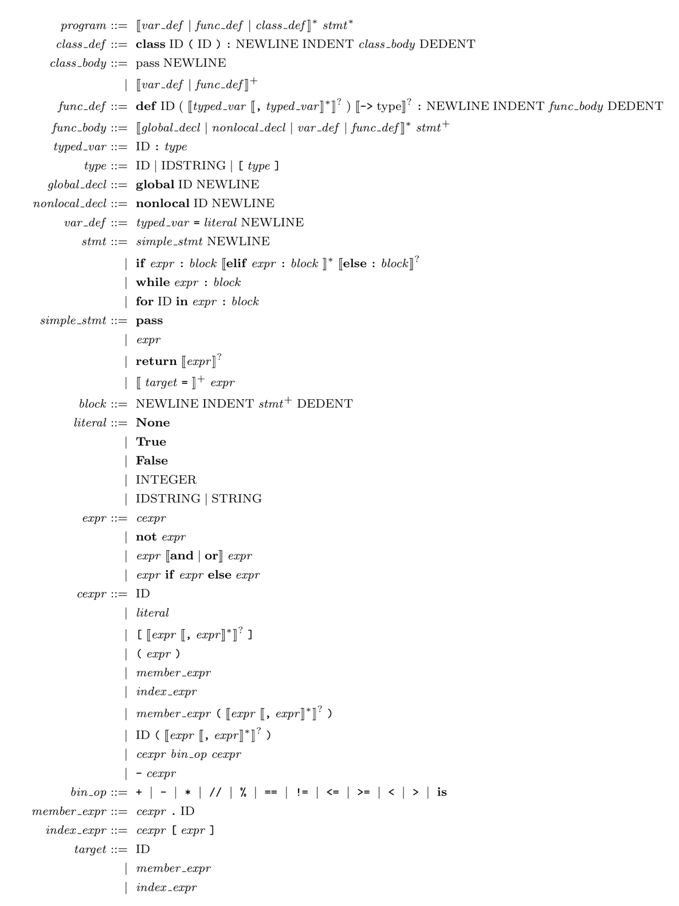

# Programing Assignment I Documentation

<!-- TOC -->

- [Programing Assignment I Documentation](#programing-assignment-i-documentation)
  - [0. Basic knowledge](#0-basic-knowledge)
    - [0.1 Python3 lexicography](#01-python3-lexicography)
    - [0.2 Simple use of FLEX](#02-simple-use-of-flex)
  - [0.4 ChocoPy Syntax](#04-chocopy-syntax)
      - [ChocoPy Grammar](#chocopy-grammar)
    - [0.4 BISON Simple Guidance](#04-bison-simple-guidance)
      - [Thinking Questions](#thinking-questions)
    - [0.5 The relationship between Bison and Flex](#05-the-relationship-between-bison-and-flex)
  - [1. Experiment requirements](#1-experiment-requirements)
    - [Main tasks](#main-tasks)
    - [Hints](#hints)
    - [1.1 Directory structure](#11-directory-structure)
    - [1.2 Bonus](#12-bonus)
    - [1.2 Compile, run and verify](#12-compile-run-and-verify)
    - [1.3 Provide usable test cases](#13-provide-usable-test-cases)
    - [1.4 Scoring](#14-scoring)

<!-- /TOC -->

## 0. Basic knowledge

In this experiment we will focus on `FLEX`, `BISON` and the `Chocopy` language, which is based on `Python 3.6`. Here is a brief introduction to them.

### 0.1 Python3 lexicography

`ChocoPy` is a subset of the Python language that does not contain `asyncio`, decorators, `yield` and `raise` semantics. The syntax of the language is described in detail at Berkeley [website](https://chocopy.org/)
The language's syntax is described in detail at Berkeley [website](), and it can be easily compiled to targets like RISC-V. The language is fully specified using formal syntax, type rules, and operational semantics.ChocoPy was designed by Rohan Padhye and Koushik Sen, with Paul
Hilfinger also contributed significantly. You can find the definition of this language at [here](https://chocopy.org/chocopy_language_reference.pdf)
to find the definition of this language. Berkeley provides documentation in java version at [here](./docs/berkeley)

1. keywords

  ```
  False,None,True,and,as,assert,async,await,break,class,continue,
  def,del,elif,else,except,finally,for,from,global,if,import,in,
  is,lambda,nonlocal,not,or,pass,raise,return,try,while,with,yield
  ```

2. Dedicated symbols

  ```
  + - * // % < > <= >= == != = ( ) [ ] , :  .  ->
  ```

3. the identifier ID and the integer NUM, defined by the following regular expression, with a maximum Int of $2^{31}-1$

  ```
  letter = a|...|z|A|...|Z
  digit = 0|...|9
  ID = letter+
  INTEGER = digit+
  ```

4. Comments are indicated by `#`

  ```
  #
  ```

5, String Literal

| Literal      | Value                       |
| ------------ | --------------------------- |
| "Hello"      | Hello                       |
| "He\" ll\"o" | He"ll"o                     |
| "He\\"llo"   | He\"llo                     |
| "Hell\o"     | (error: "o" not recognized) |

- Note: `[`, `]` are separate tokens. `[1]` must not have spaces in between.
    - `a[1]` should be recognized as four tokens: `a`, `[`, `1`, `]`

### 0.2 Simple use of FLEX

`FLEX` is a tool for generating lexical parsers. With `FLEX`, we only need to provide the regular expressions for the lexicons, and the corresponding C code can be generated automatically. The whole process is illustrated as follows.


First, `FLEX` reads the lexical scanner specification from the input file `*.lex` or `stdio` to generate the C code source file `lex.yy.c`. Then, `lex.yy.c` is compiled and linked with the `-lfl` library to generate the executable `a.out`. Finally, `a.out`
parses its input stream and converts it into a series of tokens.

Let's take a simple program wc.l for word count as an example:

```c
%{
//The code in %{ and %} is copied as is to the beginning of the resulting lex.yy.c file, where you can write the declarations and definitions
#include <string.h>
int chars = 0;
int words = 0;
%}

%%
 /* You can use your familiar regular expressions to write patterns here */
 /* You can use C code to specify the corresponding action when the pattern is matched */
 /* The yytext pointer points to the input text for this match */
 /* The left part ([a-zA-Z]+) is the regular expression to be matched, the
 	The right part ({ chars += strlen(yytext);words++;}) is the action to be performed when the regular expression is matched */
[a-zA-Z]+ { chars += strlen(yytext);words++;}


. {}
 /* For all other characters, continue without processing */

%%

int main(int argc, char **argv){
    //yylex() is a lexical analysis routine provided by flex, which reads stdin by default      
    yylex();                                                               
    printf("look, I find %d words of %d chars\n", words, chars);
    return 0;
}
```

Use Flex to generate lex.yy.c

```bash
[TA@TA example]$ flex wc.l 
[TA@TA example]$ gcc lex.yy.c -lfl
[TA@TA example]$ ./a.out 
hello world
^D
look, I find 2 words of 10 chars
[TA@TA example]$ 
```

*Note: When using stdin as input, you need to press ctrl+D to exit*

At this point, you have successfully completed a simple parser using Flex!

## 0.4 ChocoPy Syntax

This subsection will give the syntax of ChocoPy, for details please refer to [ChocoPy Language Reference](./chocopy_language_reference.pdf).

We divide all the rules of ChocoPy into five categories.

1. literals, keywords, operators and identifiers
    - `ID`
    - `type`
    - `bin_op`
        - `plusop` +
        - `minop` -
        - `mulop` *
        - `slash` //
        - `modop` %
        - `equal` ==
        - `noteq` !=
        - `lessthan` <=
        - `morethan` >=
        - `less` <
        - `more` >
        - `is` is
2. Declarations
    - `declaration-list`
        - `var-declaration`
        - `fun-declaration`
        - `class-declarations`
3. Statement
    - `statement-list`
        - `simple-stmt`
            - `pass-stmt`
            - `return-stmt`
        - `if-stmt`
        - `while-stmt`
        - `for-stmt`
4. Expression
    - `not-expr`
    - `bin-expr`
    - `member-expr`
    - `index-expr`
    - `if-expr`
    - `literal`
5. Other
    - `params`
    - `param-list`
    - `block`
    - `args`
    - `arg-list`

The start symbol is `program`。

#### ChocoPy Grammar



### 0.4 BISON Simple Guidance

This experiment involves building on the completed `flex` lexical parser and using `bison` to complete the syntax parser.

Tips: You cannot see the co-working code in the uncompiled code file. It is recommended to compile the sample calculator code given in 1.3 first, and then read `./[build_dir]/src/parser/` for `chocopy.tab.c`, `lex.yy.c`, and `chocopy.tab.c`.
and `chocopy.tab.h` files

#### Thinking Questions

This section does not count as an experiment, the intention of the questions is to help students deepen their understanding of the details of the experiment, you are welcome to write down your answers in the report or share your opinion in the issue.

1. There is a left recursive grammar in the sample code of 1.3, why can `bison` handle it? (Hint: you don't need to study the inner workings of `bison`, there is a property of `bison` mentioned in the following introduction, please think about it in the context of the class)
2. briefly explain at the code level how `yylval` can do collaborative work. (Hint: no need to study the principle, just analyze what data structure is maintained and how that data structure is related to `$1`, `$2`, etc.)
3. please try to run the example of division operation with division 0 (in the test case) using the 1.3 sample code to see if it passes, and if not, why we consider the example as legitimate in the case? (Please think briefly about the syntax and semantics)
4. Can you try to modify the 1.3 calculator grammar so that it supports division by 0 avoidance?

Bison is a parser generator that converts LALR grammars into compilable C code, thus greatly reducing the burden on programmers to design parsers manually.
Bison is a GNU reimplementation of the earlier Unix tool Yacc, so the file extension is `.y`. (Yacc stands for Yet Another Compiler Compiler.)

Each Bison file is divided into three parts by `%%`.

```c
%{
#include <stdio.h>
/* 这里是序曲 */
/* 这部分代码会被原样拷贝到生成的 .c 文件的开头 */
int yylex(void);
void yyerror(const char *s);
extern void yyrestart(FILE*); /* 如果输入参数为文件，则从文件读取 */
typedef struct yyltype {
    uint32_t first_line;
    uint32_t first_column;
    uint32_t last_line;
    uint32_t last_column;
} yyltype; /* 定义了文件位置信息 */
%}

/* 这些地方可以输入一些 bison 指令 */
/* 比如用 %start 指令指定起始符号，用 %token 定义一个 token */
%start reimu
%token REIMU

%%
/* 从这里开始，下面是解析规则 */
reimu : marisa { /* 这里写与该规则对应的处理代码 */ puts("rule1"); }
      | REIMU  { /* 这里写与该规则对应的处理代码 */ puts("rule2"); }
      ; /* 规则最后不要忘了用分号结束哦～ */
      
/* 这种写法表示 ε —— 空输入 */
marisa : { puts("Hello!"); }

%%
/* 这里是尾声 */
/* 这部分代码会被原样拷贝到生成的 .c 文件的末尾 */

int yylex(void)
{
    int c = getchar(); // 从 stdin 获取下一个字符 
    switch (c) {
    case EOF: return YYEOF;
    case 'R': return REIMU;
    default:  return 0;     // 返回无效 token 值，迫使 bison 报错
    }
}

void yyerror(const char *s)
{
    fprintf(stderr, "%s\n", s);
}

int main(void)
{
    yyparse(); // 启动解析
    return 0;
}
```

Some additional points worth noting are

1. Bison traditionally represents tokens as uppercase words and symbols as lowercase letters.
2. Bison can and can only generate parser source code (a `.c` file) and the entry point is `yyparse`, so in order to get the program running you need to provide the `main` function manually (but not necessarily in the `.y` file - you know what "link " is, right?) .
3. Bison can't detect if your action code is correct - it can only detect errors in the grammar part, the rest of the code is pasted into the `.c` file as is.
4. Bison requires you to provide a `yylex` to get the next token.
5. Bison requires you to provide a `yyerror` to provide a proper error reporting mechanism.
6. Bison requires that you provide a global variable `yydebug` to give the output of the receiving process.

Incidentally, the above `.y` works - although it can only accept two strings. Save the above code as ``reimu.y`` and execute the following command to build the program.

```shell
$ bison reimu.y
$ gcc reimu.tab.c
$ ./a.out
R<-- Don't enter press Ctrl-D here
rule2
$ ./a.out
<-- Don't enter and press Ctrl-D here
Hello!
rule1
$ ./a.out
blablabla <-- Enter or Ctrl-D
Hello!
rule1 <-- Match to rule1
syntax error <-- error found
```

So we verified that the above code does recognize the grammar definition language `{ "", "R" }`.

### 0.5 The relationship between Bison and Flex

As you may have noticed, we have hand-written a `yylex` function here as a lexical parser. And lab1 we just happened to use flex to automatically generate a lexical parser. How do we get the two to work together? In particular, we need to share token
definitions and some data between the two, do we have to maintain them manually? Haha, of course not! Here's a quick overview of how to make bison and flex work together, using a quadratic calculator - with a focus on maintaining parser state, `YYSTYPE`, and header file generation.

First, it is important to understand that bison dominates the entire workflow, while flex is only a helper, used only to generate `yylex` functions. Therefore, it is better to write the `.y` file first.

```c
/* calc.y */
%{
#include <stdio.h>
    int yylex(void);
    void yyerror(const char *s);
%}

%token RET
%token <num> NUMBER
%token <op> ADDOP MULOP LPAREN RPAREN
%type <num> top line expr term factor

%start top

%union {
    char   op;
    double num;
}

%%

top
: top line {}
| {}

line
: expr RET
{
    printf(" = %f\n", $1);
}

expr 
: term
{
    $$ = $1;
}
| expr ADDOP term
{
    switch ($2) {
    case '+': $$ = $1 + $3; break;
    case '-': $$ = $1 - $3; break;
    }
}

term
: factor
{
    $$ = $1;
}
| term MULOP factor
{
    switch ($2) {
    case '*': $$ = $1 * $3; break;
    case '/': $$ = $1 / $3; break; // 想想看，这里会出什么问题？
    }
}

factor
: LPAREN expr RPAREN
{
    $$ = $2;
}
| NUMBER
{
    $$ = $1;
}

%%

void yyerror(const char *s)
{
    fprintf(stderr, "%s\n", s);
}
```

```c
/* calc.l */
%option noyywrap

%{
/* introduce token defined by calc.y */
#include "calc.tab.h"
%}

%%

\( { return LPAREN; }
\) { return RPAREN; }
"+"|"-" { yylval.op = yytext[0]; return ADDOP; }
"*"|"/" { yylval.op = yytext[0]; return MULOP; }
[0-9]+|[0-9]+\.[0-9]*|[0-9]*\.[0-9]+ { yylval.num = atof(yytext); return NUMBER; }
" "|\t {  }
\r\n|\n|\r { return RET; }

%%
```

Finally, we add a `driver.c` to provide the `main` function.

```c
int yyparse();

int main()
{
    yyparse();
    return 0;
}
```

Build and test the program using the following command.

```shell
$ bison -d calc.y 
   (generate calc.tab.c and calc.tab.h. If the -d argument is not given, no .h file will be generated.)
$ flex calc.l
   (generates lex.yy.c)
$ gcc lex.yy.c calc.tab.c driver.c -o calc
$ ./calc
1+1
 = 1.000000
2*(1+1)
 = 4.000000
2*1+1
 = 3.000000
```

If you copy and paste the above program, you may find it amazing and incomprehensible in some places. The following is a detailed explanation of the new constructs that appear above.

* `YYSTYPE`: During bison parsing, each symbol eventually corresponds to a semantic value. Or, on the parse tree, each node corresponds to a semantic value, which is of type `YYSTYPE`. The specific content of `YYSTYPE`
  is specified by the `%union` construct. In the above example, the

  ```c
  %union {
    char   op;
    double num;
  }
  ```

  will generate code like this


  ```c
  typedef union YYSTYPE {
    char op;
    double num;
  } YYSTYPE;
  ```

  Why use `union`? Because different nodes may need different types of semantic values. For example, in the above example, we want the value of `ADDOP` to be of type `char`, while `NUMBER` should be of type `double`.

* `$$` and `$1`, `$2`, `$3`, ... : Now let's see how to derive the value of the current node from the existing value. As an example of addition.

  ```c
  term : term ADDOP factor
       {
          switch $2 {
          case '+': $$ = $1 + $3; break;
          case '-': $$ = $1 - $3; break;
          }
       }
  ```

  It is actually quite easy to understand. The current node is represented by `$$`, and the resolved nodes are numbered from left to right as `$1`, `$2`, `$3`...

* `%type <>` and `%token <>`: note that we didn't write `$1.num` or `$2.op` above! So how does bison know which part of `union` to use? The secret is in the `%type` and `%token` at the beginning of the file.
  and `%token` at the beginning of the file.

  For example, `term` should use the `num` part, so we write

  ```c
  %type <num> term
  ```

  That way, when you use `$` to fetch a value later, bison will automatically generate code like `stack[i].num`.

  `%token<>` See next entry.

* `%token`: When we declare a token with `%token`, the token is exported to `.h` and can be used directly in C code (note that token names should not conflict with anything else!) for use by flex
  for use in flex. `%token <op> ADDOP` is similar, but also passes `ADDOP` to `%type`, so one line of code is equivalent to two lines of code, which is very profitable.

* `yylval`: At this point we can open the `.h` file and see what's in it. In addition to the token definition, there is an `extern YYSTYPE yylval;` at the end. This variable, which we have used above, allows us to set the value of a token in lexer **
  inside ** to set the value of a token.

Hoo ...... said all that, now look back at the code above, you should be able to read it completely! At this point you probably realized why the flex-generated parser entry is `yylex`, because this function is what bison specifically lets programmers fill in themselves as an extension mechanism. Also, bison (or
yacc)-generated variable and function names are usually prefixed with `yy`, so hopefully it's not too late to say that here ......

Finally, it should be mentioned that although the above is sufficient for a large part of the parsing needs, bison has some advanced features, such as automatic handling of operator precedence and union (so we don't need to manually split `expr` into `factor`, `term`
). We'll leave this part to the students to explore on their own!

## 1. Experiment requirements

The output of this experiment follows the class [lsp](https://github.com/MaskRay/ccls/blob/master/src/lsp.hh)
protocol, as you can see from your tests on the web, this json transfer protocol is very suitable as a realistic interaction interface between the front and back ends, and IDEs such as VSCode also use the relevant protocol for front-end highlighting.

This experiment requires you to complete [chocopy.l] according to `ChocoPy` lexical and syntactic complements (./src/parser/chocopy.l) and [chocopy.y](./src/parser/chocopy.l)
file, complete the complete syntax parser, able to output the identified `token`, `type` ,`line_start(the number of lines just appeared)`, `pos_start(the position where the line starts)`, `line_end(the number of lines ending)`, `pos_end(the position where it ends, not included)` .
. For example.

### Main tasks

1. learn `bison` basics and understand ChocoPy syntax (focus on how to convert grammar generators into `bison` statements)
2. read `./src/parser/chocopy_parse.cpp`, corresponding to the header file `./include/parser/chocopy_parse.hpp` (focus on understanding how the parse tree is generated)
3. understand how `bison` and `flex` work together, understand the pass_node function and rewrite the Lab1 code (hint: understand how `yylval` works and how to pass values to `$1`, `$2`, etc. at the code level)
4. complete the `src/parser/chocopy.y` file and the `chocopy.l` file

### Hints

Text input.

```c
 a: int = 1
```

Then the recognition result should be

```shell
a      IDNET     1       1       1      2
:      COLON     1       2       1      3
int     INT      1       3       1      6
=      EQUAL     1       6       1      7
1      IDENT     1       7       1      8
```

The output file of the abstract syntax tree for the grammar is as follows, note that location is the beginning of the end of the sub-node tree taken and set, except for PassStmt.

```json
{
  "kind": "Program",
  "location": [1, 6, 1, 6],
  "declarations": [],
  "statements": [],
  "errors": {
    "errors": [
      {
        "kind": "CompilerError",
        "location": [ 1, 8, 1, 8],
        "message": "Parse error near token EQ: =",
        "syntax": true
      }
    ],
    "kind": "Errors",
    "location": [ 0, 0, 0, 0]
  }
}
```

If there is a lexical error, the corresponding error is `CompilerError` and `syntax=true`. The errors received for syntax are reflected as `Error`
The detection procedure does not check the error information and the number of errors, so there is no need to consider the greedy information of the error, you can find a non-receivable program directly report an error to return.

** The specific token to be identified refers to [chocopy.y](./src/parser/chocopy.y), and the abstract syntax tree to be implemented refer to [chocopy_parse.hpp](./include/parser/chocopy_parse.hpp)**

**Special note: For some of the tokens, we only need to filter them, i.e. they only need to be recognized, but should not be output to the parsing results. Because these tokens do not play any role in program operation. **

> Note that the only file you need to modify should be [chocopy.l](./src/parser/chocopy.l) and [chocopy.y](./If you find other bugs, please open a branch and just commit the bug you think you have and file a PR. `FLEX` and `BISON` usage has been briefly introduced above, for more advanced usage please refer to Baidu, Google and the official instructions.

### 1.1 Directory structure

See [common/structure.md](./docs/common/structure.md)

### 1.2 Bonus

No Bison any conflict in case all cases are received correctly.[20pts]

### 1.2 Compile, run and verify

 First fork this repo, submit that will trigger the scoring system, prohibit the submission of dead-loop program congestion CI, violators once deducted [1pts].

* Compile

  If the compilation is successful, it will be added to `./[build_dir]/` under the `parser` command.

* Run

  The `parser` command for this experiment uses the shell's input redirection feature, which means that the program itself uses standard input and output (stdin and stdout), but you can use ``<` `>` and ``>>` to flexibly customize where the output and input comes from when the shell runs the command.

  ```shell
  $ cd chocopy
  $ ./build/parser # Use interactively (no input redirection)
  < Enter ChocoPy code here, if you encounter an error, the program will report an error and exit. >
  < Press ^D to end input when done, the program will then output parsed json. >
  $ ./build/parser < test.py # redirect standard input
  < At this point the program reads the input from the test.py file, so no input is needed. >
  < If an error is encountered, the program will report the error and output the error json; otherwise, it will output the parsed json. >
  $ ./build/parser test.py # Read directly from test.py without redirection
  $ ./build/parser < test.py > out
  < At this point the program reads input from the test.py file, so no input is needed. >
  ```

  By using redirects flexibly, you can accomplish a variety of needs relatively easily, so make sure you master this shell feature.

* Verification

  There are many test cases in this experiment, so we divide them into two categories.

    1. sample: This part of the test is relatively simple and pure, suitable for debugging during development.
    2. fuzz: The correct python file generated by fuzzer, which is not open source.
    3. student: This part is provided by students.

  We use the `json.load()` command in python to verify. Compare your own generated results with the `xxx.ast` provided by the teaching assistant.

  ```shell
  $ python3 ./duipai.py --pa 1
  # If the results are exactly correct, then all PASS and a score is indicated, a correct case 1 pts, and this score is prorated into the overall rating. Students who choose chocopy will get *1.2 on the project part of the score to count towards the overall rating.
  # If there is inconsistency, it will be reported exactly which file and which part is inconsistent, and there is a detailed output.
  ```

  **Please note that the ``testcase`` provided by the teaching assistant does not cover the whole test situation, and you will only get a basic score for completing this part, so please design your own ``testcase`` to test. **
### 1.3 Provide usable test cases
For each student, you need to create a folder named `tests/pa1/student/` in the root of the repository and place 20 meaningful `*.py` test cases, 10 of which will pass all compilations and the other 10 will not pass compilations but test the error reporting system of your code. Please note that your test cases will be used to evaluate the code of others in all 4 projects, so be patient and be tough on your fellow students. Your final grade will be recalculated after all students have submitted their test cases. This section accounts for [6 pts] of the project section, but you can lower the grades of other students.

### 1.4 Scoring

1. Basic Test Sample [22*2pts]
2. Fuzzer test [16pts]
3. Student test [20pts]
4. Provide TestCase [10pts]
5. Report [10pts]
