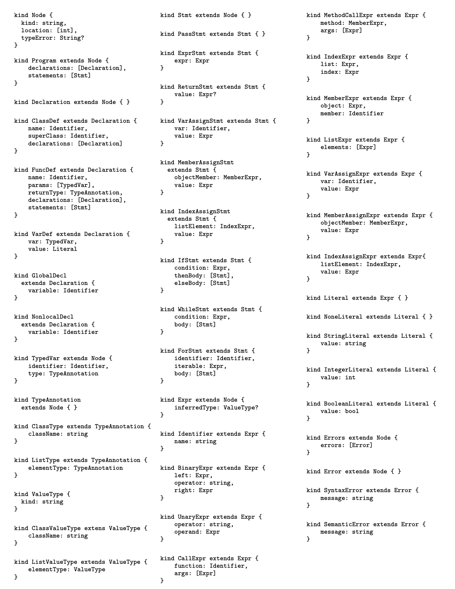
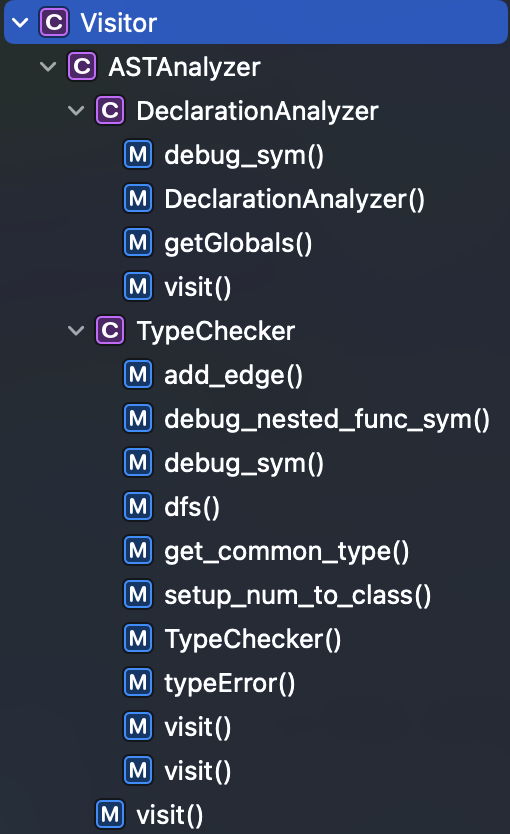

# Programing Assignment II documentation

<!-- TOC -->

- [Programing Assignment II documentation](#programing-assignment-ii-documentation)
  - [0. Basics](#0-basics)
    - [0.1 Declaration checking](#01-declaration-checking)
      - [0.1.1 Global Variable Check](#011-global-variable-check)
      - [0.1.2 for/while variable checking](#012-forwhile-variable-checking)
      - [0.1.3 Variable checking within functions](#013-variable-checking-within-functions)
      - [0.1.4 Class Variable Check](#014-class-variable-check)
      - [0.1.5 List variable checking](#015-list-variable-checking)
  - [0.2 Type Checker Checking](#02-type-checker-checking)
    - [0.2.1 Type semantics](#021-type-semantics)
    - [0.2.2 Type derivation](#022-type-derivation)
  - [0.3 Error detection](#03-error-detection)
    - [0.3.1 Semantic detection](#031-semantic-detection)
    - [0.3.3 Type detection](#033-type-detection)
  - [1. Experiment Requirements](#1-experiment-requirements)
    - [1.0.1 Main work](#101-main-work)
    - [1.0.2 Hints](#102-hints)
      - [1.0.2.1 Note the difference between the two](#1021-note-the-difference-between-the-two)
      - [1.0.2.2 Recommended Process](#1022-recommended-process)
    - [1.1 Code structure](#11-code-structure)
      - [1.1.1 ``SymbolTable``](#111-symboltable)
      - [1.1.2 `SymbolType` and `ValueType`](#112-symboltype-and-valuetype)
    - [1.2 Bonus](#12-bonus)
    - [1.3 Compile, run and verify](#13-compile-run-and-verify)
    - [1.4 WriteUp](#14-writeup)
      - [1.4.1 Compilation error](#141-compilation-error)
      - [1.4.2 Neat Code](#142-neat-code)
      - [1.4.3 Design pattern](#143-design-pattern)
      - [1.4.4 Memory Control](#144-memory-control)
      - [1.4.5 Misc and another part if needed.](#145-misc-and-another-part-if-needed)
    - [1.5 Provide available test cases](#15-provide-available-test-cases)
    - [1.6 Scoring](#16-scoring)

<!-- /TOC -->

This experiment is a team experiment, so please read the team requirements carefully and divide the work reasonably. In this experiment, you need to use `Visitor Pattern` to complete the Declaration Analysis and Type Checker Analysis of the program, and the result of the Declaration is passed to Type Checker in the form of Symbol table for further checking. The result of the Declaration is passed to the Type Checker for further checking in the form of a Symbol table, so that the LSP of `Chocopy` is free of semantic errors.

Note: Experimenting in groups implies cooperation, but communication between groups is restricted and sharing of code is strictly **prohibited**. In addition, if a group communicates with another group, you must document the group and the content of your communication in the root `README.md`. Also, you need to update the email and code WriteUp of both students in this file. See [1.4](#14-writeup) for details of WriteUp requirements.

## 0. Basics

### 0.1 Declaration checking

The `DeclarationAnalyzer` check is a check that declares the scope environment, and variables in python have four scopes

| scope                              | English Explanation       | English Short Form |
| ---------------------------------- | ------------------------- | ------------------ |
| Local scope (within a function)    | Local(function)           | L                  |
| External Nested Function Scopes    | Enclosing function locals | E                  |
| Global(module)                     | G                         |
| Scope of python's built-in modules | Builtin                   | B                  |

When accessing variables, first look for local variables, then variables inside the function that wraps around the function, then global variables, and finally variables in the built-in scope, i.e.: L -> E -> G -> B


```python
class Real(object):
    value: int = 0
    def __init__(self: "Object", val: int) -> object:
        self.value = val
    def __add__(self: "Object", other: "Object") -> Real:
        return Real(self.value + other.value)

x: int = 0
y: int = 1

def P() -> int:
    x: bool = True
    a: bool = False

    def Q() -> Real:
        x: Real = None
        x = Real(1)
        y: Real = None
        y = Real(1)
        return x + y

    return Q().value
```


#### 0.1.1 Global Variable Check

Variables defined within a function are accessible inside the function, but not outside the function. global keyword can be used to declare a global variable.

```python
x: int = 0

def f():
    x = 1  # 需要在内部声明 global x 才能获得外部变量。
    print(x)
```

#### 0.1.2 for/while variable checking

For for/while loops, variables defined inside the loop body are accessible inside the loop body, but not outside the loop body. the in keyword can be used to declare a loop variable. loop variables before in can be renamed with variables in the symbol table, and inside the loop is the semantics of c++ rewrite.

```python
def baz(self: "bar", xx: [int]) -> str:
    global count
    x: int = 0
    y: int = 1

    def qux(y: int) -> object:
        nonlocal x
        if x > y:
            x = -1

    for x in xx: # where x is not valid inside the loop for external variables
        self.p = x == 2
    qux(0) # Yay! ChocoPy
    count = count + 1
    while x <= 0:
        if self.p:
            xx[0] = xx[1]
            self.p = not self.p
            x = x + 1
        elif foo("Long"[0]) == 1:
            self.p = self is None
    return "Nope"
```

#### 0.1.3 Variable checking within functions

Python supports nested functions. Each time you enter a function, you need to enter the scope of the function's local variables and define awareness of the external E/G/B location, which cannot be renamed and need to point to the external symbol if called.

```python
x: int = 0

def crunch(zz: [[int]]) -> object:
    z: [int] = None
    global x

    def make_z() -> object:
        # need to add nonlocal z if this line is not present an error will be reported
        for z in zz: # nested function z is left value undefined, zz is call right value, direct access
            pass # Set z to last element in zz

    make_z()
    for x in z:
        pass # Set x to last element in z


crunch([[1, 2], [2, 3], [4, 5], [6, 7]])
print(x) # Variable changes inside the nest are visible outside similar to c++ [&] lambda Semantic
```

#### 0.1.4 Class Variable Check

Class needs to be defined first, declared later, and then the variables defined.

```python
class animal(object):
    makes_noise: bool = False

    def make_noise(self: "animal") -> object:
        if (self.makes_noise):
            print(self.sound())

    def sound(self: "animal") -> str:
        return "???"


class cow(animal):
    def __init__(self: "cow"):
        self.makes_noise = True

    def sound(self: "cow") -> str:
        return "moo"


c: animal = None
c = cow()
c.make_noise()  # Prints "moo"
```

Predefined classes have object, int, bool, str, list. all have `__init__` methods, and attributes. custom classes can customize `__init__` methods, and inheritance puts in the attributes and methods of the inherited class first, then its own. then its own.

```python
class A(object):
    a: int = 42

    def foo(self: "A", ignore: object) -> int:
        return self.a

    def bar(self: "A") -> int:
        print("A")
        return 0


class B(A):
    b: bool = True

    def __init__(self: "B"):
        print("B")

    def bar(self: "B") -> int:
        print("B")
        return 0


class C(B):
    c: bool = True

    def __init__(self: "C"):
        print("C")

    def foo1(self: "C") -> int:
        print("B")
        return 0

    def bar(self: "C") -> int:
        print("C")
        return 0


def t():
    def f():
        return 0

    return 0


d: str = input()
a: A = None
if d == "sb":
    a = C()
else:
    a = A()

print(a.bar())
```

The declaration can declare the father class and dynamically determine the actual class. it is then necessary to dynamically typeclass to get the methods.

#### 0.1.5 List variable checking

A List implementation is a class, so it is defined in the same way as a class instantiation. Initialization calls `conslist()`, which in the riscv assembly is an attribute placed after __len__, an array of list/bool/int/str/object/classes.

```bash
.globl $.list$prototype
$.list$prototype:
  .word -1                                 # Type tag for class: .list
  .word 4                                  # Object size
  .word 0                                  # Pointer to dispatch table
  .word 0                                  # Initial value of attribute: __len__
  .align 2
```

The statement is as follows.

```python
x: [[bool]] = None
y: str = "Hello"
z: [int] = None
i: int = 0

x: [[bool]] = [[True, False], [False, True]]
z = [1, 2, 3]

for i in z:
    print(i)

while i < len(z):
    print(z[i][1])
    print(y[i])
    i = i + 1
```

List and str both have `len()` method to get length, both can get elements with index access, for statement is equivalent to `while i<len(*)`.

## 0.2 Type Checker Checking

This is implemented in the `TypeChecker` class.

### 0.2.1 Type semantics

Each type has a type tag with the following predefined meaning.

```cpp
enum type { LIST=-1, OBJECT, INT, BOOL, STRING, CLASS };

constexpr bool is_list_type() const { return tid_ == type::LIST; }
constexpr bool is_void_type() const { return tid_ == type::VOID; }
constexpr bool is_integer_type() const { return tid_ == type::INT; }
constexpr bool is_bool_type() const { return tid_ == type::BOOL; }
constexpr bool is_string_type() const { return tid_ == type::STRING;}
constexpr bool is_value_type() const { return is_bool_type() ||  
             is_string_type() || is_integer_type(); }
constexpr bool is_class_type() const { return tid_ >= type::CLASS; }
```

int/bool/str cannot be inherited, all defined classes inherit from object. there are two auxiliary types `<None>`, `<Empty>`. type tag is calculated when you first enter `TypeChecker`, because at that point `DeclarationAnalyzer` takes the SymbolTable has already been evaluated.

```cpp
/** set up default class hierarchy
 * <None> <= object
 * <Empty> <= object
 * <None> <= <None>
 * <Empty> <= <Empty>
 */
map<string, string> super_classes = {{"int", "object"},  {"bool", "int"},  
                                     {"none", "object"},  {"empty", "object"},
                                     {"<None>", "object"},  {"<Empty>", "object"}};
```
The following are the basic types of propagation.

1. $T_{1} \leq T_{2}$ (i.e., ordinary subtyping)
2. $T_{1}$ is <None $>$ and $T_{2}$ is not int, bool, or str.
3. $T_{2}$ is a list type $[T]$ and $T_{1}$ is <Empty>.
4. $T_{2}$ is a list type $[\mathrm{T}]$ and $T_{1}$ is $[\langle$ None $\rangle]$, where $\langle$ None $\rangle
   \leq_ a T$

The last two are defined to prevent the cases x:[A] = [None, None] and x:[ [A ]] = [[None]], while the list cannot be propagated if the internal type is different.

For other op's type propagation can be portrayed by Least Common Ancestor.

1. if $A\leq_{a} B$, then $A\sqcup B=B\sqcup A=B$. 2.
2. Otherwise, $A\sqcup B$ is just the least common ancestor of $A$ and $B$ in the tree type hierarchy defined by $\leq$.

### 0.2.2 Type derivation

This section is detailed in [ChocoPy Language Reference](./chocopy_language_reference.pdf), Section 5. The first step is to define the Type Environment where we are now, defined by a quadruple $<O,M,C,R>$, which defines the checking environment of the `TypeChecker`, $O$ by the global `SymbolTable` , $M$ is determined by the `ClassDefType`, $C$ is determined by the local `SymbolTable`, and $R$ is determined by the `FunctionDefType`. Take the `is` keyword as an example.

$$O, M, C, R \vdash e_{1}: T_{1}\\ O, M, C, R \vdash e_{2}: T_{2}\\ \frac{T_{1}, T_{2} \text { are not one of } i n t, s t r, \text { bool }}{O, M, C, R \vdash e_{1} \text { is } e_{2}: \text { bool }}$$

The rule needs to be written in `BinaryExpr`, if `operator` is `is`, determine if there is a subclass relation, if it is wrong, return bool.

Another example of `IfStmt`

$$O, M, C, R \vdash e_{0}: bool\\ O, M, C, R \vdash b_{0}\\ O, M, C, R \vdash e_{1}: bool\\ O, M, C, R \vdash b_{1}\\
\vdots\\ O, M, C, R \vdash e_{n}: bool\\ O, M, C, R \vdash b_{n}\\ n \geq 0\\ O, M, C, R \vdash b_{n+1}\\ \overline{O,
M, C, R \vdash \text { if } e_{0}: b_{0} \text { elif } e_{1}: b_{1} \ldots \text { elif } e_{n}: b_{n} \text { else }:
b_{n+1}}$$

You need to check that all condition return types are not bool, and also that there is a least common ancestor relationship for the definition.

For the Function Invoke example, all arguments are subclasses of the definition.

$$O, M, C, R \vdash e_{1}: T_{1}^{\prime \prime}\\ O, M, C, R \vdash e_{2}: T_{2}^{\prime \prime}\\ \vdots\\ O, M, C, R
\vdash e_{n}: T_{n}^{\prime \prime}\\ n \geq 0\\ O(f)=\left\{T_{1} \times \cdots \times T_{n} \rightarrow T_{0} ; x_{1},
\ldots, x_{n} ; v_{1}: T_{1}^{\prime}, \ldots, v_{m}: T_{m}^{\prime}\right\}\\ \forall 1<i<n: T_{i}^{\prime \prime}<_{q}
T_{i}\\ \overline{O, M, C, R \vdash f\left(e_{1}, e_{2}, \ldots, e_{n}\right): T_{0}}$$

Please consult and implement other rules by your students.

## 0.3 Error detection

All official errors that need to be reported are in [pa2](./../tests/pa2/sample) under the **bad** header.

1. [bad_duplicate_global.py](../../tests/pa2/sample/bad_duplicate_global.py)/[bad_duplicate_local.py](../../tests/pa2/sample/bad_duplicate_local.py) requires Duplicate declaration of identifier in
   same scope.
2. [bad_expr_binary.py](../../tests/pa2/sample/bad_expr_binary.py)/[bad_expr_unary.py](../../tests/pa2/sample/bad_expr_unary.py) requires BinaryExpr/UnaryExpr's type cannot cast.
3. [bad_func_def_return.py](../../tests/pa2/sample/bad_func_def_return.py)/[bad_func_def_call.py](../../tests/pa2/sample/bad_func_def_call.py)/[bad_return_missing.py](../../tests/pa2/sample/bad_return_missing.py)/[bad_return_top.py](../../tests/pa2/sample/bad_return_top.py) requires Function 的 type checking not passing.
4. [bad_list_assign.py](../../tests/pa2/sample/bad_list_assign.py)/[bad_list_index.py](../../tests/pa2/sample/bad_list_index.py) requires List 的 type checking not passing.
5. [bad_nonlocal_global.py](../../tests/pa2/sample/bad_nonlocal_global.py)/[bad_shadow_local.py](../../tests/pa2/sample/bad_shadow_local.py)/[bad_shadow_local_2.py](../../tests/pa2/sample/bad_shadow_local_2.py) requires Scope not passing.
6. [bad_*_assign.py](../../tests/pa2/sample/bad_*_assign.py)/[bad_type_*.py](../../tests/pa2/sample/bad_type_*.py) requires Assign Variable not passing.

The semantic analysis phase detects two types of errors: semantic errors and type checking errors. Semantic errors are violations of the semantic rules listed above. Type checking errors are violations of the type rules listed in the ChocoPy Language Reference Manual. If the input program contains semantic errors, the output of the semantic analysis phase is expected to be a list of semantic error messages and the location of their sources. Type checking errors are only reported if there are no semantic errors. Type-checking errors are reported online along with the typed AST, as described.

### 0.3.1 Semantic detection

Your implementation should be able to recover from semantic errors and continue to analyze the rest of the program in order to report as many semantic errors as possible. Unlike recovering from a parsing error, error recovery in semantic analysis is much easier to perform, since you can simply report an error and continue to analyze the rest of the AST.

The autograder will use the following rule to evaluate implementations on inputs that contain semantic errors: A test will pass only if all semantic errors reported by the reference implementation are also reported by the implementation you submit. That is, the semantic errors reported by the reference implementation should be a subset of the errors reported by the implementation.

### 0.3.3 Type detection

Type checking errors are only reported if there are no semantic errors in the input program. In the absence of semantic errors, the semantic analysis phase should output a typed AST in JSON format, regardless of whether the program is well-typed or not. If an AST node in the program fails to type check, then an error message is inserted in the typeError attribute of the corresponding Node. Let's call such a node
`ill-typed` node.

1. `-1` can be seen as `UnaryExpr` or int type.
2. When type checking assignment expressions for variables, attributes and list elements, the type inferred in a well-typed expression is usually the right-valued type. However, if the right-hand expression does not match the type of the position being assigned, then the analysis should insert an error message and infer the type of the left-hand side of the assignment instead. Of course, if the left-hand side is not a valid variable, property, or list element, then the analysis must resort to inferring the object of the entire assignment expression.
3. An ambiguity arises when type checking the binary operator $+$, because the inferred type of a well-typed $+$ expression is different depending on whether its two operands are of type int, str, or list. This rule of thumb does not provide a unique solution for the case where one operand is int and the other operand is str. The analysis should handle badly typed $+$ expressions in the following way: if at least one operand is of type int, then infer int; otherwise, infer object. in both cases, an appropriate error message must be inserted at the incorrectly typed expression.

## 1. Experiment Requirements

The output of this experiment can achieve the requirement of semantic checking, built on the basis that there are no errors in the syntax, and the same can be output highlighted in the IDE.

This experiment requires you to complete [chocopy_semant.cpp](./src/semantic/chocopy_semant.cpp) based on the semantic of `ChocoPy`
file, completing the complete syntax parser, capable of outputting the locations where semantic errors are identified.

### 1.0.1 Main work

1. learn `visitor` schema basics and understand ChocoPy semantics (focus on understanding how to be in `visitor` schema)
2. read `./src/semantic/chocopy_ast.cpp` and `./src/semantic/chocopy_semant.cpp` (focus on understanding the use of analysis trees)
3. understand `./src/semantic/chocopy_semant.cpp` and complete the semantic checks
4. complete `./src/semantic/chocopy_semant.cpp` file, you can add other `Analyzer`, and if you need other rewritten code you can rewrite it yourself.
5. explain your design, difficulties and solutions in `README.md`

### 1.0.2 Hints

Text input.

```c
a: int = 1
```

then the corresponding semantic check result should be

```json
{
  "kind" : "Program",
  "location" : [ 1, 1, 1, 11 ],
  "declarations" : [ {
    "kind" : "VarDef",
    "location" : [ 1, 1, 1, 10 ],
    "var" : {
      "kind" : "TypedVar",
      "location" : [ 1, 1, 1, 6 ],
      "identifier" : {
        "kind" : "Identifier",
        "location" : [ 1, 1, 1, 1 ],
        "name" : "a"
      },
      "type" : {
        "kind" : "ClassType",
        "location" : [ 1, 4, 1, 6 ],
        "className" : "int"
      }
    },
    "value" : {
      "kind" : "IntegerLiteral",
      "location" : [ 1, 10, 1, 10 ],
      "value" : 1
    }
  } ],
  "statements" : [ ],
  "errors" : {
    "errors" : [ ],
    "kind" : "Errors",
    "location" : [ 0, 0, 0, 0 ]
  }
}
```

The abstract syntax tree output file for semantics is as follows, note the difference between Type Error and Declaration Error output location.

```json
{
  "kind" : "Program",
  "location" : [ 1, 1, 1, 11 ],
  "declarations" : [ {
    "kind" : "VarDef",
    "location" : [ 1, 1, 1, 10 ],
    "var" : {
      "kind" : "TypedVar",
      "location" : [ 1, 1, 1, 6 ],
      "identifier" : {
        "kind" : "Identifier",
        "location" : [ 1, 1, 1, 1 ],
        "name" : "a"
      },
      "type" : {
        "kind" : "ClassType",
        "location" : [ 1, 4, 1, 6 ],
        "className" : "int"
      }
    },
    "value" : {
      "kind" : "IntegerLiteral",
      "location" : [ 1, 10, 1, 10 ],
      "inferredType" : {
        "kind" : "ClassValueType",
        "className" : "int"
      },
      "value" : 1
    }
  } ],
  "statements" : [ ],
  "errors" : {
    "errors" : [ ],
    "kind" : "Errors",
    "location" : [ 0, 0, 0, 0 ]
  }
}
```

#### 1.0.2.1 Note the difference between the two

1. New object types **ValueType**, **ClassValueType**, **ListValueType** have been added. These will be used to store type information for program expressions inferred from type checking. Note that these types are almost identical to **TypeAnnotation**
   and its two subtypes are almost exactly similar.
   
   The difference between **TypeAnnotation** and **ValueType** is that the latter does not extend the Node; therefore, the ValueType object does not have a location attribute. This should make sense since the types assigned during semantic analysis do not actually exist in the source code.
   2.
   The type Expr has a new property: inferredType, which can be null. in the AST generated by the parser, this property is null for each expression. Semantic analysis infers the type for each program expression that can be evaluated. Specifically, the inferredType attribute remains null only for the following cases.
    1. appears directly in **FuncDef**, **ClassDef**, **TypedVar**, **GlobalDecl**, **NonlocalDecl**, **VarAssignExpr**, **VarAssignStmt**, **MemberExpr**, ** ForStmt **, or **CallExpr** properties of the identifier object
    2. immediately after **MethodCallExpr**, **MemberAssignExpr** or **MemberExpr** contained in **MemberAssignStmt**
    3. followed by **IndexExpr** contained in **IndexAssignExpr** or **IndexExpr** contained in **IndexAssignStmt**. Note that it is acceptable for null attributes to be simply omitted from the JSON representation. 3.
3. If there are syntax errors, the corresponding errors are `CompilerError` and `syntax=true`. For syntax received errors embodied as `Error`, the detection program will not check the error information and the number of errors, so there is no need to consider the greedy information of the error, you can find a non-receivable program to return directly to the error.
    1. Node kind has a new property: **typeError**. In the AST generated by the parser, this attribute is empty for each node. If an error occurs while type checking a node, then the **typeError** of that node
       will be non-empty. For a well-typed ChocoPy program, the **typeError** attribute of each node will be null in the output of the semantic analysis phase. Note that it is acceptable for the null attribute to be simply omitted in the JSON representation.
     2. In addition to **SyntaxError**, a new **SemanticError** category has been added. If the input AST corresponds to a ChocoPy program containing semantic errors, then the output of the semantic analysis phase should be a JSON object of type **Errors**, which will contain one or more nodes of type **SemanticError**. Note that the **SemanticError** (semantic error) object does inherit a locations attribute. This property will contain the source code location corresponding to the AST node whose analysis caused the error.

#### 1.0.2.2 Recommended Process

This task may be much larger than the previous one. However, this task gives you more room for flexible implementation strategies for your design decisions. I have provided some guidance in the form of a skeleton implementation in the starter code, and here are the flow suggestions. However, which step you end up taking is largely up to you.

1. Tree Traversal Write the basic `visit()`.
2. Type Hierarchy Finish writing the symbol table.
3. Type Checking Implement all type checking.

**Refer to [All Errors](#03-Error Detection) for specific syntax derivation errors to be identified, and [chocopy_ast.hpp](../../include/parser/chocopy_ast.hpp) for the abstract syntax tree to be implemented**

> Note that the only file you need to modify should be [chocopy_semant.cpp](../../src/semantic/chocopy_semant.cpp) and [chocopy_parse.cpp](../../src/parser/chocopy_parse.cpp), the latter is used to modify the output, and if you find other bugs, please open a branch to commit only the bugs you think you have and file a PR. Information about `visitor pattern` usage is already in [visitor.md](./visitor.md) for a short introduction, for more advanced usage see Google and StackOverflow.

### 1.1 Code structure

See [common/structure.md](./docs/common/structure.md)



#### 1.1.1 ``SymbolTable``
```cpp
class SymbolTable {
public:
    /** A table representing a region nested in that represented by PARENT. */
    explicit SymbolTable(SymbolTable *parent0) { this->parent = (SymbolTable *)parent0; }
    SymbolTable() { this->parent = nullptr; }
    /* Returns the mapping in this scope or in the parent scope using a recursive traversal */
    template <typename T> T get(const string &name);
    /** Adds a new mapping in the current scope, possibly shadowing mappings in the parent scope. */
    template <typename T> SymbolTable *put(const string &name, T value);
    map<string, SymbolType *> *tab = new map<string, SymbolType *>();
    SymbolTable *parent;
    map<string, int> class_tag_;
}
```
The mapping of names to Types is stored in a Map, with different tags for different classes, maintained in a tree structure by the parent, and symbols in the symbol table can be retrieved and added via the `get<T>` and `put<T>` methods. `debug_sym()` and `debug_nested_func()` can traverse the top-level symbol table to get all the information. `template <class Key, class T> set<string> key_to_set(const std::map<Key, T> &map, std::set<Key> &set);` can turn set in class `Analyzer` into map.

#### 1.1.2 `SymbolType` and `ValueType`
```cpp
class SymbolType {
public:
    virtual constexpr bool is_value_type() { return false; }
    virtual constexpr bool is_list_type() { return false; }
    virtual constexpr bool is_func_type() { return false; }
    virtual constexpr int *is_none_type() { return new int[4]; }
    virtual constexpr bool is_special_type() { return false; }

    virtual string get_name() = 0;
    virtual void set_name(string_view className) = 0;
    virtual string get_type() const = 0;

    template <typename _Ty> bool eq(const _Ty &_Value);
    template <typename _Ty> bool neq(const _Ty &_Value);
};
```
`SymbolType` is a purely dummy class for marking all types, implementing `eq` and `neq`. `ValueType` and `FunctionDefType` both inherit from `SymbolType`.

```cpp
class ValueType : public SymbolType {
public:
    ValueType() = default;
    bool is_value_type() override { return true; }
    static ValueType *annotate_to_val(parser::TypeAnnotation *annotation);
    string get_name() override;
};
```

`ClassValueType` and `ListValueType` both inherit from `ValueType`. The type can be determined by `is_*_type()` and `annotate_to_val()` is converted from `TypeAnnotation` to `Type`.

### 1.2 Bonus

Report errors for all given cases if all given syntax derivations are made correctly [10pts]

### 1.3 Compile, run and verify

* Compile

  If the compilation is successful, then the code in `./[build_dir]/` under the `semantic` command.

* Run

  The `semantic` command for this experiment uses the shell's input redirection feature, which means that the program itself uses standard input and output (stdin and stdout), but you can use `<` `>` and `>>` to flexibly customize where the output and input comes from when the shell runs the command.

  ```shell
  $ cd chocopy
  $ ./build/semantic # Use interactively (no input redirection)
  < Enter ChocoPy code here and if you encounter an error, the program will report an error and exit. >
  < Press ^D to end input when done, the program will then output parsed json. >
  $ ./build/semantic < test.py # redirect standard input
  < At this point the program reads the input from the test.py file, so no input is needed. >
  < If an error is encountered, the program will report the error and output the error json; otherwise, it will output the parsed json. >
  $ ./build/semantic test.py # Read directly from test.py without redirection
  $ ./build/semantic < test.py > out
  < At this point the program reads input from the test.py file, so no input is needed. >
  ```

  By using redirects flexibly, you can accomplish a variety of needs relatively easily, so make sure you master this shell feature.

* Verification

  There are many test cases in this experiment, so we divide them into two categories.

    1. sample: This part of the test is relatively simple and pure, suitable for debugging during development.
    2. fuzz: The correct python file generated by fuzzer, which is not open source.
    3. student: This part is provided by students.

  We use the `json.load()` command in python to verify. Compare your generated results with the `xxx.typed.ast` provided by your teaching assistant, the location part can have 1-2 location errors.

  ```shell
  $ python3 ./duipai.py --pa 2
  # If the result is exactly correct, then all PASS, and there is a score hint, a correct case 1 pts, this score is proportional to the total evaluation. Students who choose chocopy will get *1.2 on the project part of the score to count towards the overall rating.
  # If there is inconsistency, it will be reported exactly which file and which part is inconsistent, and there is a detailed output.
  ```

  **Please note that the ``testcase`` provided by the teaching assistant does not cover the whole test situation, and you will only get a basic score for completing this part, so please design your own ``testcase`` to test.**

  **Please design your own `testcase` to test.**

### 1.4 WriteUp

The group needs to provide a design doc for WriteUp and needs to provide the following sections.

#### 1.4.1 Compilation error
In tag xxx, how you fix the compilation error, using gdb, Valgrind, or by other people.

#### 1.4.2 Neat Code
In the final tag, how do you change the pointer to a smart pointer to save the residual code.

#### 1.4.3 Design pattern
What design pattern do you utilize when you organize your type semantics?

#### 1.4.4 Memory Control
How do you manage your memory?

#### 1.4.5 Misc and another part if needed.
You can simply answer my questions asked when committing you submit here.

### 1.5 Provide available test cases
For each group, create a folder called `tests/pa2/student/` in the root of the repository and place 20 meaningful `*.py` test cases, 10 of which will pass all compilations and 10 of which will not pass compilations but will test your code's error reporting system. Please note that your test cases will be used to evaluate the code of others in all 4 projects, so be patient and be tough on your fellow students. Your final grade will be recalculated after all students have submitted their test cases. This portion accounts for [6 pts] of the project portion, but you may lower the other students' grades.

### 1.6 Scoring

1. Basic Test Sample [55 pts]
2. Fuzzer test [10pts]
3. Student test [20pts]
4. Provide TestCase [5pts]
5. Report [10pts]
