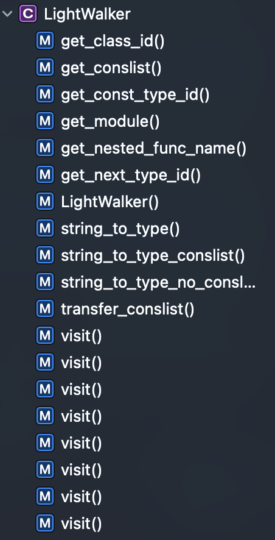
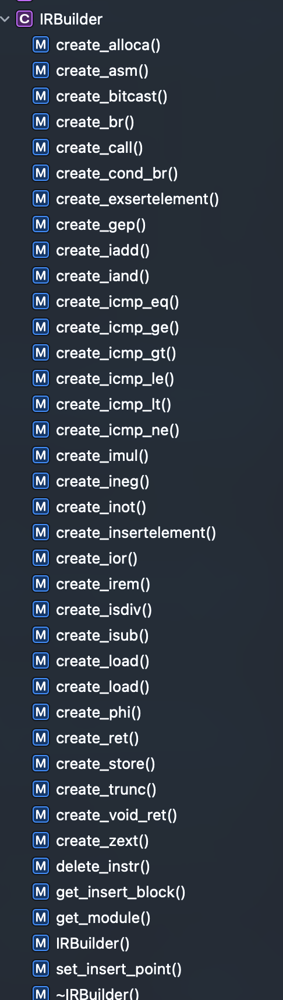

# Programing Assignment III documentation

<! -- TOC -->

- [Programing Assignment III documentation](#programing-assignment-iii-documentation)
- [lab3-experiment documentation](#lab3-experiment-documentation)
  - [0. Basics](#0-basics)
    - [0.1 Light IR type design](#01-light-ir-type-design)
      - [0.1.1 Light IR Constant/Global Variable](#011-light-ir-constantglobal-variable)
      - [0.1.2 Light IR Function](#012-light-ir-function)
        - [General Function](#general-function)
        - [Nested Functions](#nested-functions)
        - [Function Call](#function-call)
      - [0.1.3 Light IR Class](#013-light-ir-class)
        - [Class Definition](#class-definition)
        - [Method Invocation](#method-invocation)
        - [Method Dispatched](#method-dispatched)
    - [0.2 Light IR stdlib calls](#02-light-ir-stdlib-calls)
  - [1. Experimental requirements](#1-experimental-requirements)
    - [1.1 Code structure](#11-code-structure)
    - [1.2 Main work](#12-main-work)
      - [1.2.1 A few notes](#121-a-few-notes)
    - [1.3 Bonus](#13-bonus)
    - [1.4 Compile, Run and Verify](#14-compile-run-and-verify)
    - [1.5 Scoring](#15-scoring)

<! -- /TOC -->

# lab3-experiment documentation

This experiment is a team experiment, please read the team requirements carefully and divide the work reasonably. This experiment, like Lab3, requires the use of the `LightIR` framework to automatically generate LLVM IR for the `ChocoPy` language, and the implementation needs to refer to the Operational Semantic section of `ChocoPy`. It is recommended to have a discussion within the pre-experiment team to ensure that members understand the issues in Lab3.

We believe that you have mastered the use of LightIR and have some understanding of LLVM IR. In this experiment, we are going to use visitor mode to implement IR generation automatically. For the generated IR, we can call clang to generate an executable file, so that a primary ChocoPy compiler is complete!

Note: Experimenting in groups implies collaboration, but communication between groups is restricted and sharing of code is strictly **prohibited**. In addition, if a group communicates with another group, you must document the group and the content of your communication in the root `README.md`. Also, you need to update both students' emails and the code WriteUp in this file, see [WriteUp requirements](./PA2/README.md#14-writeup).

## 0. Basics

### 0.1 Light IR type design

First on `LightIR` there is the primitive type of `LLVM`: i8/i32/arr/ptr. str is defined on top of this as i8*. prototype is defined as class. the full type definition is in `Type.hpp`. All ``Type``s are available via the factory pattern `::get()`.

```c++
enum type { CLASS_ANON = -7, LABEL, FUNC, VOID, UNION, VECTOR, LIST, OBJECT, INT, BOOL, STRING, CLASS };
```
You can compare size and determine subclass/subtype between types with the trinomial expression `<=>`. `FunctionType` can get the type of Argument/Return. `ArrayType` can get the element type. `VectorType` is the intermediate kernel pass form for generating vectorized code. `Union` is the type that defines the paradigm pass. `ListType` is used for the definition of `$.list$prototype`, which is inherited from `Class` and needs to be defined separately because it is still necessary to define a `$strlist$prototype_type` for each internal type list when generating.

Each `Value` will have a `Type`.

#### 0.1.1 Light IR Constant/Global Variable

Both Constant and Global Variable are defined in `Constant*` or `GlobalVariable`, the former can be used as an initialization tool for the latter. The definitions are given in the header section after the declaration.

```c++
GlobalVariable::create(fmt::format("const_{}", const_id), &*module, new ConstantStr(STR_T, node.value, const_id));
```

#### 0.1.2 Light IR Function

##### General Function
First, refer to the Function Definition definition.

$$g_{1}, \ldots, g_{L}\text{ are the variables explicitly declared as global in }f\\
y_{1}=e_{1}, \ldots, y_{k}=e_{k}\text{ are the local variables and nested functions defined in }f\\
\frac{E_{f}=E\left[G\left(g_{1}\right) / g_{1}\right] \ldots\left[G\left(g_{L}\right) / g_{L}\right]}{
v=\left(x_{1}, \ldots, x_{n}, y_{1}=e_{1}, \ldots, y_{k}=e_{k}, b_{\text {body }}, E_{f}\right)G, E, S \vdash def f\left(x_{1}: T_{1}, \ldots, x_{n}: T_{n}\right) [ \rightarrow T_{0} ]^{?}: b: v, S,_{-}}$$

Definition
```c++
auto func_type = FunctionType::get(string_to_type(return_type), tmp_func_params);
auto function Function::create(func_type, name, module.get());
```

Function can be defined to be called before main and only needs to initialize the `is_ctor` variable.
##### Nested Functions
Although the nested function is defined above, i.e., variables captured by `E` should also be passed as arguments, the definition on `LightIR` is more like the definition of the `C++` lambda `[&]{}`, i.e., all references to variables are captured and passed uniformly through `$class.anon`, into the first argument.

For example
```python
x:int = 0
def crunch(zz:[[int]]) -> object:
    z:[int]] = None
    global x
    def make_z() -> object:
        nonlocal z
        for z in zz:
            pass # Set z to last element in zz

    make_z()
    for x in z:
        pass # Set x to last element in z

crunch([[1,2],[2,3],[4,5],[6,7]])
print(x) 
```
needs to be defined as the following

```llvm
define void @$crunch(%$.list$prototype_type* %arg0) {

label1:
  %op2 = alloca i32
  %op3 = alloca %$class.anon_make_z, align 4
  %op4 = getelementptr %$class.anon_make_z, %$class.anon_make_z* %op3, i32 0, i32 0
  store i32* %op2, i32** %op4
  %op5 = getelementptr %$class.anon_make_z, %$class.anon_make_z* %op3, i32 0, i32 1
  store %$.list$prototype_type* %arg0, %$.list$prototype_type** %op5
  call void @$crunch.make_z(%$class.anon_make_z* %op3)
  %op6 = load i32, i32*@x
  br label %label7

label7:                                                ; preds = %label1, %label13
  %op8 = phi i32 [ %op6, %label1 ], [ %op11, %label13 ]
  %op9 = icmp ne i32 %op6, %op8
  %op10 = getelementptr i32, i32* %op2, i32 %op8
  %op11 = add i32 %op8, 1
  %op12 = load i32, i32* %op10
  br label %label13

label13:                                                ; preds = %label7
  br  i1 %op9, label %label7, label %label14

label14:                                                ; preds = %label13
  ret void
}
define void @$crunch.make_z(%$class.anon_make_z* %arg0) {

label1:
  %op2 = alloca i32
  store i32 0, i32* %op2
  %op3 = bitcast %$.list$prototype_type* %arg0 to %$union.len*
  %op4 = call i32 @$len(%$union.len* %op3)
  br label %label5

label5:                                                ; preds = %label1, %label14
  %op6 = phi i32 [ %op4, %label1 ], [ %op9, %label14 ]
  %op7 = icmp ne i32 %op4, %op6
  %op8 = getelementptr %$.list$prototype_type, %$.list$prototype_type* %arg0, i32 0, i32 4
  %op9 = add i32 %op6, 1
  %op10 = load %$union.conslist*, %$union.conslist** %op8
  %op11 = bitcast %$union.conslist* %op10 to i32*
  %op12 = getelementptr i32, i32* %op11, i32 %op6
  %op13 = load i32, i32* %op12
  br label %label14

label14:                                                ; preds = %label5
  br  i1 %op7, label %label5, label %label15

label15:                                                ; preds = %label14
  ret void
}
```
##### Function Call

Consistent with Method Call.

#### 0.1.3 Light IR Class

Class definition inherits both `Type` and `Value`. Initialization defaults to having typetag as the first class element and attribute size as the second. By default there is only one methods, `__init__`, and if it is an inherited relationship, you need to figure out which of the most recent ancestor definitions is called in methods.
##### Class Definition
Refer to the Object Instantialization definition first.
$$
class(T)=\left(a_{1}=e_{1}, \ldots, a_{m}=e_{m}\right) \quad m \geq 1 \\
l_{a 1}, \ldots, l_{a m}= newloc (S, m) \\
v_{0}=T\left(a_{1}=l_{a i}, \ldots, a_{m}=l_{a m}\right) \\
G, G, S \vdash e_{1}: v_{1}, S,_{-} \\
G, G, S \vdash e_{2}: v_{2}, S,{ }_{-} \\
\vdots \\
G, G, S \vdash e_{m}: v_{m}, S,{ }_{-} \\
S_{1}=S\left[v_{1} / l_{a 1}\right] \ldots\left[v_{m} / l_{a m}\right] \\
l_{\text {init }}=l_{a i} \text{ such that } a_{i}=\_\_init\_\_\\
S_{1}\left(l_{\text {init }}\right)=\left(x_{0}, y_{1}=e_{1}^{\prime}, \ldots, y_{k}=e_{k}^{\prime}, b_{b o d y}, E_{f}\right) \quad k \geq 0 \\
l_{x 0}, l_{y 1}, \ldots, l_{y k}=n e w l o c\left(S_{1}, k+1\right) \\
E^{\prime}=E_{f}\left[l_{x 0} / x_{0}\right]\left[l_{y 1} / y_{1}\right] \ldots\left[l_{y k} / y_{k}\right] \\
G, E, S_{1} \vdash e_{1}^{\prime}: v_{1}^{\prime}, S_{1},_- \\
\vdots \\
G, E, S_{1} \vdash e_{k}^{\prime}: v_{k}^{\prime}, S_{1},_- \\
S_{2}=S_{1}\left[v_{0} / l_{x 0}\right]\left[v_{1}^{\prime} / l_{y 1}\right] \ldots\left[v_{k}^{\prime} / l_{y k}\right] \\
\frac{G, E^{\prime}, S_{2} \vdash b_{b o d y}:-, S_{3},, 
}{G, E, S \vdash T(): v_{0}, S_{3},{ }_{-}}$$

This rule performs the following operations, all of which need to be generated at the `LightIR` level. First, a new object $$v_{0}$$ of class $$T$$ is created by assigning a location to each Attribute and Method defined or inherited by class $$T$$. Second, the Attribute initializer and Method definition are evaluated using the global environment; this distinction is important because the Method definition does not capture the environment $E$ in which the object is being built. Third, the current store $S_{1}$ is modified by creating a new store by mapping the newly allocated attributes and methods for $v_{0}$. Finally, the object $v_{0}$'s `__init__`. method is called via dynamic scheduling. The steps required to call this method are similar to a normal dynamic dispatch, with the exception that the `__init__`. method takes no arguments other than the object being called.

##### Method Invocation

$$S_{0}(E(f))=\left(x_{1}, \ldots, x_{n}, y_{1}=e_{1}^{\prime}, \ldots, y_{k}=e_{k}^{\prime}, b_{b o d y}, E_{f}\right)\\
n, k \geq 0\\
G, E, S_{0} \vdash e_{1}: v_{1}, S_{1},_{-}\\
\vdots\\
G, E, S_{n-1} \vdash e_{n}: v_{n}, S_{n},_-\\
l_{x 1}, \ldots, l_{x n}, l_{y 1}, \ldots, l_{y k}=n e w l o c\left(S_{n}, n+k\right)\\
E^{\prime}=E_{f}\left[l_{x 1} / x_{1}\right] \ldots\left[l_{x n} / x_{n}\right]\left[l_{y 1} / y_{1}\right] \ldots\left[l_{y k} / y_{k}\right]\\
G, E^{\prime}, S_{n} \vdash e_{1}^{\prime}: v_{1}^{\prime}, S_{n},_-\\
\vdots\\
G, E^{\prime}, S_{n} \vdash e_{k}^{\prime}: v_{k}^{\prime}, S_{n},_-\\
S_{n+1}=S_{n}\left[v_{1} / l_{x 1}\right] \ldots\left[v_{n} / l_{x n}\right]\left[v_{1}^{\prime} / l_{y 1}\right] \ldots\left[v_{k}^{\prime} / l_{y k}\right]\\
\frac{G, E^{\prime}, S_{n+1} \vdash b_{b o d y}:_-, S_{n+2}, R \\
R^{\prime}=\left\{\begin{array}{l}N o n e, \text { if } R \text { is } \\ R, \text { otherwise }\end{array} \quad\right. }{ G, E, S_{0} \vdash f\left(e_{1}, \ldots, e_{n}\right): R^{\prime}, S_{n+2},_-}$$

First, the value of the function is fetched from the current storage space. Second, the arguments of the function call are evaluated in left-to-right order. Then, new locations are allocated for the function's formal arguments, local variables, and nested functions. A new environment $E^{\prime}$ is created for the function call, which maps the names of formal arguments, local variables and nested functions to their corresponding locations. The memory $S_{n+1}$ maps these locations to their corresponding arguments, initial values and function values, respectively. Finally, the body of the function is evaluated using this new environment $E^{prime}$ and the initial state $S_{n+1}$. The function call expression is evaluated to the value returned by the body of the function, or to a None value if the body of the function is fully evaluated and no return statement is encountered.

##### Method Dispatched
$$G, E, S \vdash e_{0}: v_{0}, S_{0},- \\
v_{0}=X\left(a_{1}=l_{1}, \ldots, f=l_{f}, \ldots, a_{m}=l_{m}\right) \\
S_{0}\left(l_{f}\right)=\left(x_{0}, x_{1}, \ldots, x_{n}, y_{1}=e_{1}^{\prime}, \ldots, y_{k}=e_{k}^{\prime}, b_{\text {body }}, E_{f}\right) \\
n, k \geq 0 \\
G, E, S_{0} \vdash e_{1}: v_{1}, S_{1},- \\
\vdots \\
G, E, S_{n-1} \vdash e_{n}: v_{n}, S_{n},- \\
l_{x 1}, \ldots, l_{x n}, l_{y 1}, \ldots, l_{y k}=n e w l o c\left(S_{n}, n+k\right) \\
E^{\prime}=E_{f}\left[l_{x 0} / x_{0}\right] \ldots\left[l_{x n} / x_{n}\right]\left[l_{y 1} / y_{1}\right] \ldots\left[l_{y k} / y_{k}\right] \\
G, E^{\prime}, S_{n} \vdash e_{1}^{\prime}: v_{1}^{\prime}, S_{n},- \\
\vdots \\
G, E^{\prime}, S_{n} \vdash e_{k}^{\prime}: v_{k}^{\prime}, S_{n},- \\
S_{n+1}=S_{n}\left[v_{0} / l_{x 0}\right] \ldots\left[v_{n} / l_{x n}\right]\left[v_{1}^{\prime} / l_{y 1}\right] \ldots\left[v_{k}^{\prime} / l_{y k}\right] \\
G, E^{\prime}, S_{n+1} \vdash b_{\text {body }}:-, S_{n+2}, R \\
\frac{R^{\prime}=\left\{\begin{array}{l}\text { None, if } R \text { is } \\
R, \text { otherwise }\end{array}\right. }{ G, E, S \vdash e_{0} \cdot f\left(e_{1}, \ldots, e_{n}\right): R^{\prime}, S_{n+2},-}$$
Dispatch needs to solve for the obj expression first, with object being the first parameter passed.
### 0.2 Light IR stdlib calls
This code is partially referenced in [src/cgen/stdlib](https://github.com/Chocopy-LLVM/chocopy-llvm/blob/main/src/cgen/stdlib) directory. To call the functions in stdlib, you only need `create_call`, and note that you need to pass parameters. Students can also customize the functions that need to be called repeatedly in stdlib.

## 1. Experimental requirements

### 1.1 Code structure

See [common/structure.md](./docs/common/structure.md)

This experiment uses LightIR, written in C++, to generate LLVM IR.

To facilitate your experiments, the framework automatically completes the conversion of the syntax tree to an abstract syntax tree on C++. We can use the visitor pattern to design the algorithms in the abstract syntax tree.



IRBuilder provides function generation, e.g. `builder->create_clloca()` to generate a statement. `set_insert_point()` is used to switch the insertion code position. CFG and Use-Def List are automatically calculated after insertion.



In [chocopy_optimization.hpp](https://github.com/Chocopy-LLVM/chocopy-llvm/blob/main/include/ir-optimizer/chocopy_optimization.hpp), a class Scope is defined for storing scopes, which is used to assist us in converting `SymbolTable` to `Scope` and managing variables in different scopes. It provides the following interface.

```c++
// Enter a new scope
void enter();
// exit a scope
void exit();
// Insert a new name->value mapping to the current scope
bool push(std::string name, Value *val);
// Find the value, based on the name
Value* find(std::string name);
// Find the value in the global scope based on the name
Value* find_in_global(std::string name);
// Find the value in the nonlocal scope based on the name and return the loaded value.
Value* find_in_nonlocal(std::string name, IRBuilder *builder);
// Determine if the current value is in global scope
bool in_global();
```

### 1.2 Main work

1. read [Introduction to the LightIR core classes](./common/LightIR.md)
2. read [Experimental Framework](#1-Experimental Framework) to understand how to use the framework and the considerations
3. modify [chocopy_lightir.cpp](../../src/ir-optimizer/chocopy_lightir.cpp) to implement the automatic IR generation algorithm so that it compiles any legitimate ChocoPy program correctly
4. explain your design, difficulties encountered and solutions in `README.md`

#### 1.2.1 A few notes
Due to the fact that LLVM IR is strongly typed and cannot take arguments to generate fp action records, there are many parts of the code that are not the same as those generated by Berkeley

1. char* or .string
2. activation record does not use frame pointer to roll back function local variables. 3.
3. several call conventions, this project completely uses the c calling convention.

```bash
 *******************
 * CALL CONVENTION *
 *******************
NAME        CLEAN       PARA_DIRECTION
---------------------------------------------
cdecl       caller      <-
stdcall     callee      <-
pascal      callee      ->
fastcall    callee      2reg, <-
USING **pascal**
```
4. In order to fit the paradigm, many places use union type to pass reference, llvm union definition must be pointer type, so I also store pointer in `$.list$prototype_type`, not VLA (Variable length array).

### 1.3 Bonus

1. complete Basic Pass[60 pts]
2. complete Optimized Pass[$\infty$ pts]

### 1.4 Compile, Run and Verify

* Compile

  If the compilation is successful, the `ir-optimizer` command will be generated under `./[build_dir]/` under the `ir-optimizer` command.

* Run

  The `ir-optimizer` command for this experiment uses command-line arguments to compile and run.

  ```shell
  $ cd chocopy
  $ ./build/ir-optimizer test.py -run # Compile directly to elf with the clang compiler for qemu to execute.
  $ ./build/ir-optimizer test.py -emit # Output.
  $ ./build/ir-optimizer test.py -assem # Output assembly.
  $ ./build/ir-optimizer test.py -pass [PassName] # Run pass.
  <The above options can be used together>
  ```

  By using redirects flexibly, you can accomplish a wide variety of needs relatively easily, so please make sure your students master this shell feature.

* Verification

  There are many test cases in this experiment, so we divide them into two categories.

    1. sample: This part of the test is relatively simple and pure, suitable for debugging during development.
    2. fuzz: The correct python file generated by fuzzer, which is not open source.
    3. student: This part is provided by students.

  We use the `diffutil` tool in python to verify. Compare your own generated results with the `xxx.typed.ast.result` provided by your teaching assistant.

  ```shell
  $ python3 ./duipai.py --pa 3
  # If the result is exactly correct, then all PASS, and a score is indicated, a correct case 1 pts, and this score is prorated into the total evaluation. Students who choose chocopy will get *1.2 on the project part of the score to count towards the overall rating.
  # If there is inconsistency, it will be reported exactly which file and which part is inconsistent, and there is a detailed output.
  ```

  **Please note that the ``testcase`` provided by the teaching assistant does not cover the whole test situation, and you will only get a basic score for completing this part, so please design your own ``testcase`` to test.**

### 1.5 Scoring

1. Basic test case [80 * 3/4 pts]
2. Fuzzer test [10 pts]
3. Student test [10 pts]
4. Provide TestCase [10 pts]
5. Report [10 pts]
