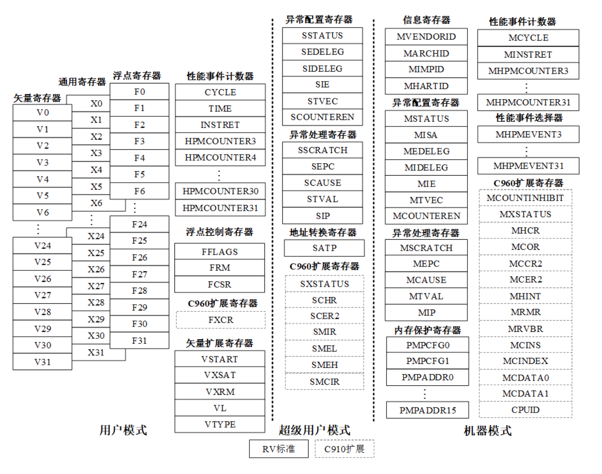
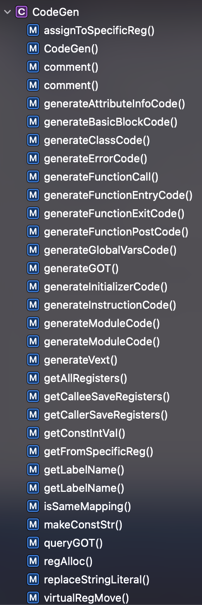

# Programing Assignment IV documentation

<!-- TOC -->

- [Programing Assignment IV documentation](#programing-assignment-iv-documentation)
  - [0. Basics](#0-basics)
    - [0.1 Standard Library](#01-standard-library)
    - [0.2 RISCV Spec](#02-riscv-spec)
    - [0.3 Introduction to the backend](#03-introduction-to-the-backend)
      - [0.3.1 Abstraction of registers and addresses](#031-abstraction-of-registers-and-addresses)
      - [0.3.2 access memory](#032-access-memory)
        - [0.3.2.1 Addressing mode](#0321-addressing-mode)
      - [0.3.3 Register Assignment](#033-register-assignment)
      - [0.3.4 Vector expansion](#034-vector-expansion)
    - [0.4 Memory management](#04-memory-management)
  - [1. Experimental requirements](#1-experimental-requirements)
    - [1.1 Code structure](#11-code-structure)
    - [1.2 Main tasks](#12-main-tasks)
    - [1.3 Compiling, running and verifying](#13-compiling-running-and-verifying)
    - [1.4 Bonus](#14-bonus)
    - [1.5 Scoring](#15-scoring)

<!-- TOC -->

In CodeGen, we need to generate back-end code from Light IR, LLVM IR requires only simple conversion instructions, function call specification and register assignment. This is why LLVM IR is so popular, very simple code generation for arbitrary architectures. LLVM's own implementation can be found at [source code here](https://github.com/llvm-mirror/llvm/blob/master/include/llvm/IR/) IntrinsicsRISCV.t).

## 0. Basics
The back-end typically requires the implementation of three components.

1. instruction selection
2. instruction scheduling
3. register allocation
### 0.1 Standard Library
See [docs/common/stdlib](../docs/common/stdlib.md) for definition. Only register state pairs are needed for calling, `call [func]` is sufficient.
### 0.2 RISCV Spec
See [RISCV Spec](https://riscv.org/technical/specifications/), [RVV](https://github.com/riscv/riscv-v-spec) for definitions.

### 0.3 Introduction to the backend

#### 0.3.1 Abstraction of registers and addresses
The address of the value.
```c++
class Value {
public:
    virtual constexpr bool is_reg() const = 0;
    virtual constexpr bool is_constant() const = 0;
    virtual constexpr bool has_shift() const = 0;
    virtual constexpr string_view get_name() const = 0;
};
```
Abstraction of registers
```c++
class Reg : public Value {
    int id;
public:
    explicit Reg(int id) : id(id) {
        if (id < 0 || id > max_reg_id) {
            LOG(ERROR) << "Invalid Reg ID!";
            abort();
        }
    }
    bool is_reg() const override { return true; }
    bool is_constant() const override { return false; }
    bool has_shift() const override { return false; }
    int getID() const { return this->id; }
    string_view get_name() const override { return reg_name[id]; }
    constexpr bool operator<(const Reg &rhs) const { return this->id < rhs.id; }
    constexpr bool operator==(const Reg &rhs) const { return this->id == rhs.id; }
    constexpr bool operator!=(const Reg &rhs) const { return this->id ! = rhs.id; }
};
class RegShift : public Value {
public:
    enum ShiftType { lsl, lsr, asl, asr }
private:
    int id;
    int shift;
    ShiftType _t;
}
ðŸ™' ðŸ™'
callee \& caller saved \& temporary \& general register
```c++
const vector<InstGen::Reg> caller_save_regs =
  {InstGen::Reg(1), InstGen::Reg(5),  
  InstGen::Reg(6), InstGen::Reg(7),
  InstGen::Reg(10), InstGen::Reg(11), 
  InstGen::Reg(12), InstGen::Reg(13),
  InstGen::Reg(14), InstGen::Reg(15), 
  InstGen::Reg(16), InstGen::Reg(17),
  InstGen::Reg(28), InstGen::Reg(29),
  InstGen::Reg(30), InstGen::Reg(31)};
const vector<InstGen::Reg> callee_save_regs = 
  {InstGen::Reg(2), InstGen::Reg(8),
  InstGen::Reg(9), InstGen::Reg(18),
  InstGen::Reg(19), InstGen::Reg(20), 
  InstGen::Reg(21), InstGen::Reg(22),
  InstGen::Reg(23), InstGen::Reg(24), 
  InstGen::Reg(25), InstGen::Reg(26),
  InstGen::Reg(27)};
const vector<InstGen::Reg> allocate_regs = 
  {InstGen::Reg(10), InstGen::Reg(11), 
  InstGen::Reg(12), InstGen::Reg(13),
  InstGen::Reg(14), InstGen::Reg(15), 
  InstGen::Reg(16), InstGen::Reg(17)};
const vector<InstGen::Reg> temp_regs = 
  {InstGen::Reg(5), InstGen::Reg(6),  
  InstGen::Reg(7), InstGen::Reg(28),
  InstGen::Reg(29), InstGen::Reg(30), 
  InstGen::Reg(31)};
```
Address
```c++
class Addr {
    Reg reg;
    int offset;
    string str;
public:
    explicit Addr(Reg reg, int offset) : reg(std::move(reg)), offset(offset) {}
    Addr(string str) : str(std::move(str)), reg(Reg(0)), offset(0) {}
    Addr(string_view str) : str(str.begin(), str.end()), reg(Reg(0)), offset(0) {}
    Addr(const char *str) : str(str), reg(Reg(0)), offset(0) {}
    Reg getReg() const { return this->reg; }
    int getOffset() const { return this->offset; }
    string_view get_name() const;
};
```
A Label with a name
```c++
class Label {
    string label;
    int offset;
public:
    explicit Label(string label, int offset) : label(move(label)), offset(offset) {}
    explicit Label(string label) : label(move(label)), offset(0) {}
    string_view get_name() const { return fmt::format("{}+{}", label, offset); }
};
```
For faster access to memory, we need to record the memory size, L1, L2 cache size, and can emit some code that is good for spatial locality and only needs to match stride within those three numbers.


#### 0.3.2 access memory
##### 0.3.2.1 Addressing mode

The following are the available registers given by the Xuantie C910, most of them are status registers.



For CISC machines, the addressing is as follows. Note that the first four are base addressing and the last four are scale addressing

| type      | AT&T syntax format | operation value        | name                               |
| --------- | ------------------ | ---------------------- | ---------------------------------- |
| immediate | \$ Imm             | Imm                    | immediate addressing               |
| immediate | \$ Imm             | Imm                    | immediate addressing               |
| registers | Ea                 | R[Ea]                  | register addressing                |
| memory    | Imm                | M[Imm]                 | absolute addressing                |
| memory    | (Ea)               | M[R[Ea]]               | indirect addressing                |
| memory    | Imm(Eb)            | M[Imm+R[Eb]]           | (base address + offset) addressing |
| memory    | (Eb, Ei)           | M[R[Eb]+R[Ei]]         | variant addressing                 |
| memory    | Imm(Eb, Ei)        | M[Imm+R[Eb]+R[Ei]]     | variant addressing                 |
| memory    | (, Ei, s)          | M[R[Ei] * s]           | proportional variant addressing    |
| memory    | Imm(, Ei, s)       | M[Imm+R[Ei] * s]       | proportional variant addressing    |
| memory    | (Eb, Ei, s)        | M[R[Eb]+R[Ei] * s]     | proportional variant addressing    |
| memory    | Imm(Eb, Ei, s)     | M[Imm+R[Eb]+R[Ei] * s] | proportional variant addressing    |

For riscv only the first four types of addressing are available. They correspond to addi a0, a0, imm/add a0,a0,a1/j a0/[jal && auipc+jalr](https://stackoverflow.com/questions/59150608/offset-address-for-jal-and-jalr-instrctions-in-risc-v)

Other addressing can be done with multiple instruction operands or [%hi() %lo()](https://stackoverflow.com/questions/62060724/address-offset-in-risc-v-load-instructions-hardcoded-or-not) to accomplish this. New (base address + offset) addressing has been added to the Xuantie C910.

0.3.2.2 load/store

In addition to providing load and store for 32-bit words (lw, sw), signed and unsigned bytes and halfwords (lb, lbu, lh. lhu) and stored bytes and halfwords (sb, sh) are also available. Signed byte and halfword symbols are expanded to 32 bits and then written to the destination register. There is no discrimination for all types and they are treated fairly.

0.3.2.3 vldx

For any architecture, the priority supply of bandwidth within the microarchitecture must be vector registers. This can be done by first fetching data from memory into the vector registers and then loading from the vector registers to the target registers. In x86 this process is movnt via the SSE register or vmovntdq via the AVX512 register. In riscv this process is vldx, and it should be noted that it is generally necessary to query the [bandwidth by part](https://www.laruence.com/sse/) of the processor to get the detailed cost model.

0.3.2.4 Global Offset Table([GOT](https://en.wikipedia.org/wiki/Global_Offset_Table))

In order to better load a constant, we cannot directly load it. Usually, there is a limit to the span of memory addresses that can be searched for by load, and if we need to span a long memory address, we need to do a memory slack before doing a jump. If the addressable range is still exceeded, multiple addresses are needed to reach it. This process is often computed in linker, because linking multiple files to a linked library requires global variables that can be addressed across GOT links, as detailed [in](https://maskray.me/blog/2021-08-29-all-about-global-offset-table). In a single file, it is also necessary to maintain a global offset table so that the address of the label can be found faster with any of the four addressing methods.


#### 0.3.3 Register Assignment

Each node in the Interface Graph represents the active or live range of a variable. Live range is defined from the first time a variable is defined (assigned) until the last time it is used before it is next assigned. The edge between two nodes indicates that the two variables' active periods conflict or interfere with each other due to overlapping lifetimes. In general, if two variables are active (live) at the same time at a point in the function, they conflict with each other and cannot occupy the same register. This project uses the [graph coloring algorithm](https://web.eecs.umich.edu/~mahlke/courses/583f12/reading/chaitin82.pdf), and also the [linear scan algorithm](https://www2.seas.gwu.edu/~hchoi/teaching/cs160d/linearscan.pdf), and the [Second chance binpacking algorithm](https://www.zhihu.com/question/56005792/answer/), which favors the CISC instruction set). The [SSA form](http://citeseerx.ist.psu.edu/viewdocs/download?doi=10.1.1.162.2590&rep=rep1&type=pdf) brings the advantage of effectively reducing the length of a single interval, which in a CISC instruction set computers, which can be very effective in the CISC instruction set. Also, the sparse nature of IR in SSA form is fully utilized to avoid iterative liveness analysis. effectively reducing the time complexity.

#### 0.3.4 Vector expansion

For the vector expansion generated by the back-end, it is necessary to start the vector expansion generation from extractelement using state register markers such as vsetivli, and then start the vector expansion generation with pattern matching. You can [refer to](https://github.com/riscv/riscv-v-spec/blob/master/example/vvaddint32.s).

### 0.4 Memory management
In lab4, all compiled ChocoPy programs will have 32MB of memory available. The register gp will point to the beginning of the heap before the first top-level statement is executed. Garbage collection (GC) has not been implemented in the reference implementation; therefore, newly allocated objects block space for the entire remainder of the program. While the heap and object layout are designed so that GC can be easily implemented, we do not expect you to implement GC in this job. the tests used by the automatic scorer require much less memory than 32MB to execute.
## 1. Experimental requirements

### 1.1 Code structure

See [common/structure.md](./docs/common/structure.md)



CFG walks through the main function `generateMOduleCode` to get Assembly, other functions are called by the main function. Iterate through all compilable units, Class->Func->Var->Instruction. Also need to maintain GOT to get the location of the label, the rest of the instructions are emit by type.
### 1.2 Main tasks

1. read [LLVM tablegen related documentation](https://llvm.org/docs/TableGen/index.html), how to design the backend if not designing DSL.
2. read [experimental framework](#1-experimental-requirements) to understand how to use the framework and the considerations
3. modify [chocopy_cgen.cpp](https://github.com/Chocopy-LLVM/chocopy-llvm/blob/main/src/cgen/chocopy_cgen.cpp) to implement an assembly from IR to riscv so that it compiles any legal ChocoPy program correctly
4. explain your design, difficulties encountered and solutions in `README.md`

### 1.3 Compiling, running and verifying

* Compile

  If the compilation is successful, the program will be created in `./[build_dir]/`, the `cgen` and `chocopy` commands will be generated.

* Run

  The `cgen` and `chocopy` commands for this experiment use command line arguments to compile and run.

  ```shell
  $ cd chocopy
  $ ./build/cgen test.py -run # Compile directly to elf with the clang compiler for qemu to execute.
  $ ./build/cgen test.py -assem # Output assembly.
  $ ./build/chocopy test.py -O[0/1/2/3] -run # Customize the optimization level.
  <The above options can be used together>
  ```


* Validation

  There are many test cases in this experiment, so we divide these tests into two categories.

    1. sample: This part of the test is relatively simple and pure, suitable for debugging during development.
    2. fuzz: the correct python file generated by fuzzer, this is not open source.
    3. benchmark: students can add their own compilation options (add Pass, you can add `-O0`, `-O1`, `-O2`, `-O3` by default) corresponding to different passes.
    4. student: This part is provided by the students.

  We use to add the RVV1.0 extension ``qemu-riscv32`''
  
  ```shell
  $ python3 ./duipai.py --pa 4
  # If the result is exactly correct, then all PASS, and there is a score hint, a correct case 1 pts, this score is proportional to the total evaluation. Students who choose chocopy will get *1.2 on the project part of the score to count towards the overall rating.
  # If there is inconsistency, it will be reported exactly which file and which part is inconsistent, and there is a detailed output.
  ```

  We use the `diffutil` tool in python for validation. Compare your own generated results with the `xxx.typed.ast.result` provided by the teaching assistant.

  **Please note that the `testcase` provided by the tutor does not cover all the test cases, completing this part will only get you a base score, please design your own `testcase` for testing.**
  
  **Please design your own `testcase`.**


### 1.4 Bonus
- Code generation considering L1/L2 Size [10 pts]
  - Gemm Benchmark speedup ratio is improved by more than 1.5 times.
- Instruction Scheduling Strategy [20 pts]
  - Avoid instruction pipeline stalls by reordering instructions
  - Avoid illegal or semantically ambiguous operations (involving typically subtle instruction pipeline timing issues or non-interlocking resources)
  - Instruction selection for load/store/li constants
- Linear scan register allocation [10 pts]
### 1.5 Scoring

1. Basic test sample [80 * 3/4 pts]
2. Fuzzer test [5 pts]
3. Student test [5 pts]
4. Benchmark test [15 pts]
5. Provide TestCase [5 pts]
6. Report [10 pts]
