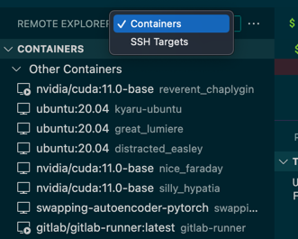
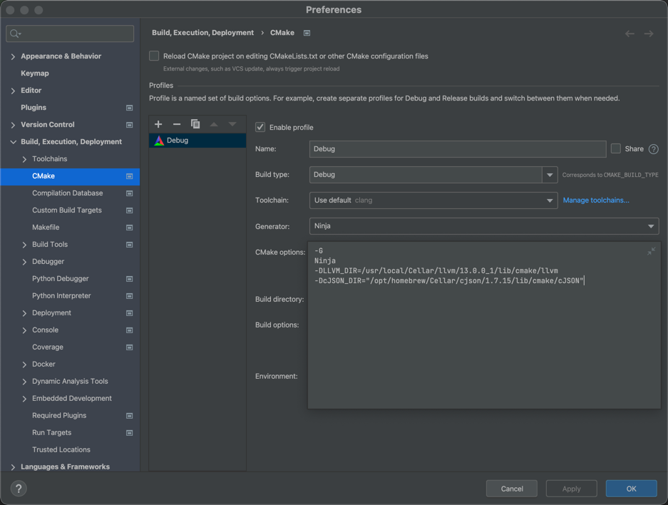
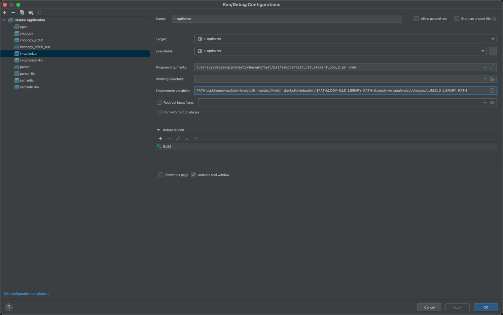

# 如何编译？

如果有任何解决不了的编译问题，请自行解决，环境是计算机学生的入门课，实在不行OH可以提供解答。

## 编译LLVM的 `--target=riscv64-unknown-linux-gnu` 编译器
windows 可以参考 [Windows](https://www.emdalo.com/posts/risc-v-gnu-compiler-toolchain-howto-compile-on-windows/) ，其余操作系统可以参考 [*nix](http://blog.kmckk.com/archives/5774305.html)

```bash
set -x -e

[ -z $TOP ] && export TOP=$PWD/riscv64

[ -z $PARA ] && export PARA=-j32

INSTALL64=$TOP/install64
BUILD64=$TOP/build64
export PATH=$INSTALL64/bin/:$PATH
export ARCH64="rv64gcv"
export CLANG_ARCH64="${ARCH64}0p10 -menable-experimental-extensions"
export ABI64=lp64d
export TARGET64=riscv64-unknown-elf
export CLANG_CFLAGS64="--target=${TARGET64} -march=${CLANG_ARCH64} -mabi=${ABI64}"

SRC=$PWD/src

mkdir -p $SRC
cd $SRC

git clone --depth 1 -b rvv-1.0.x-zfh https://github.com/riscv/riscv-binutils-gdb.git

wget ftp://sourceware.org/pub/newlib/newlib-4.1.0.tar.gz
tar xvf newlib-4.1.0.tar.gz

git clone --depth 1 https://github.com/llvm/llvm-project.git

mkdir -p $INSTALL64 $BUILD64

cd $BUILD64

mkdir binutils
cd binutils/
$SRC/riscv-binutils-gdb/configure --prefix=$INSTALL64 --target=$TARGET64 --enable-lto --disable-werror --disable-shared --disable-nls --with-sysroot=yes
make $PARA && make install
cd $BUILD64

mkdir clang
cd clang/
cmake -DLLVM_ENABLE_PROJECTS="clang;lld" \
      -G "Unix Makefiles" $SRC/llvm-project/llvm \
      -DCMAKE_BUILD_TYPE=Release \
      -DCMAKE_INSTALL_PREFIX=$INSTALL64 \
      -DLLVM_TARGETS_TO_BUILD="RISCV" \
      -DLLVM_DEFAULT_TARGET_TRIPLE=$TARGET64 \
      -DLLVM_BUILD_EXAMPLES=OFF \
      -DLLVM_INCLUDE_EXAMPLES=OFF \
      -DBUILD_SHARED_LIBS=OFF \
      -DLLVM_OPTIMIZED_TABLEGEN=ON \
      -DLLVM_ENABLE_LIBXML2=OFF \
      -DCLANG_DEFAULT_RTLIB=compiler-rt \
      -DCLANG_DEFAULT_UNWINDLIB=libunwind \
      -DCLANG_DEFAULT_CXX_STDLIB=libc++

make $PARA && make install
cp bin/* $INSTALL64/bin
cd $BUILD64

ARGSTR='"$@"'
echo "${INSTALL64}/bin/clang ${CLANG_CFLAGS64} -Wno-unused-command-line-argument ${ARGSTR}" > $INSTALL64/bin/riscv64-unknown-elf-clang
echo "${INSTALL64}/bin/clang++ ${CLANG_CFLAGS64} -Wno-unused-command-line-argument ${ARGSTR}" > $INSTALL64/bin/riscv64-unknown-elf-clang++
chmod +x $INSTALL64/bin/$TARGET64-clang
chmod +x $INSTALL64/bin/$TARGET64-clang++

# stdlib.h is required to build compiler-rt, so we need to build newlib first.

mkdir newlib
cd newlib

export CFLAGS_FOR_TARGET=" -g -gdwarf-3 -gstrict-dwarf -O2 -ffunction-sections -fdata-sections "
export CC_FOR_TARGET=$TARGET64-clang
export AS_FOR_TARGET=$TARGET64-clang
export LD_FOR_TARGET=lld
export CXX_FOR_TARGET=$TARGET64-clang++
export AR_FOR_TARGET=llvm-ar
export NM_FOR_TARGET=llvm-nm
export RANLIB_FOR_TARGET=llvm-ranlib
export OBJCOPY_FOR_TARGET=llvm-objcopy
export OBJDUMP_FOR_TARGET=llvm-objdump
export READELF_FOR_TARGET=llvm-readelf
export STRIP_FOR_TARGET=llvm-strip
export LIPO_FOR_TARGET=llvm-lipo
export DLLTOOL_FOR_TARGET=llvm-dlltool

$SRC/newlib-4.1.0/configure --prefix=$INSTALL64 --target=$TARGET64 --disable-multilib --disable-nls
make $PARA all && make install
cd $BUILD64

mkdir libcompiler_rt
cd libcompiler_rt

export CC="${INSTALL64}/bin/${TARGET64}-clang"
export CXX="${INSTALL64}/bin/${TARGET64}-clang++"
export AR="${INSTALL64}/bin/llvm-ar"
export NM="${INSTALL64}/bin/llvm-nm"
export RANLIB="${INSTALL64}/bin/llvm-ranlib"
export OBJCOPY="${INSTALL64}/bin/llvm-objcopy"
export LLVM_CONFIG="${INSTALL64}/bin/llvm-config"

TARGET_CFLAGS=""
TARGET_CXXFLAGS="${TARGET_CFLAGS}"
TARGET_LDFLAGS=""

LLVM_VERSION=`$CC -dumpversion`
LLVM_RESOURCEDIR=/lib/clang/$LLVM_VERSION

cmake -G "Unix Makefiles" $SRC/llvm-project/compiler-rt \
    -DCMAKE_INSTALL_PREFIX=$INSTALL64/$LLVM_RESOURCEDIR/ \
    -DCMAKE_TRY_COMPILE_TARGET_TYPE=STATIC_LIBRARY \
    -DCMAKE_CROSSCOMPILING=True \
    -DCMAKE_SYSTEM_NAME=Linux \
    -DCMAKE_BUILD_TYPE=Release \
    -DCOMPILER_RT_BUILD_BUILTINS=ON \
    -DCOMPILER_RT_BUILD_SANITIZERS=OFF \
    -DCOMPILER_RT_BUILD_XRAY=OFF \
    -DCOMPILER_RT_BUILD_LIBFUZZER=OFF \
    -DCOMPILER_RT_BUILD_PROFILE=OFF \
    -DCOMPILER_RT_BUILD_MEMPROF=OFF \
    -DCOMPILER_RT_BUILD_XRAY_NO_PREINIT=OFF \
    -DCOMPILER_RT_SANITIZERS_TO_BUILD=none \
    -DCMAKE_C_COMPILER=$CC \
    -DCMAKE_CXX_COMPILER=$CXX \
    -DCMAKE_AR=$AR \
    -DCMAKE_NM=$NM \
    -DCMAKE_RANLIB=$RANLIB \
    -DLLVM_CONFIG_PATH=$LLVM_CONFIG \
    -DCMAKE_C_COMPILER_TARGET=$TARGET64 \
    -DCOMPILER_RT_DEFAULT_TARGET_ONLY=ON \
    -DCMAKE_C_FLAGS="${TARGET_CFLAGS}" \
    -DCMAKE_CXX_FLAGS="${TARGET_CXXFLAGS}" \
    -DCMAKE_EXE_LINKER_FLAGS="${TARGET_LDFLAGS}" \
    -DCOMPILER_RT_BAREMETAL_BUILD=ON \
    -DCOMPILER_RT_OS_DIR=""

make $PARA && make install
cd $BUILD64
```

## 编译具有rvv的qemu

仅能在Linux上使用。
```bash
git clone https://github.com/sifive/qemu -b v5.2.0-rvv-rvb-zfh
cd qemu
mkdir build
cd build
../configure --target-list=riscv64-softmmu,riscv32-softmmu,riscv64-linux-user,riscv32-linux-user --enable-kvm 
./qemu-riscv32 -cpu rv32,x-v=true,x-k=true,vlen=256,elen=64,vext_spec=v1.0 -g 1234 [file] <-在1234端口开启gdb-server
```

## Docker

此方法全平台通用，在内部已经有所有编译好的二进制文件。

`docker pull yangyw12345/cs131-grader`

可以在 `VSCode` 中开发，需要在 docker 中安装插件安装插件 `Docker`、`CMake`、`C/C++ Extension`，其他配置[参考](https://b23.tv/84juhvu).



## Windows

**注意：Lab3 Bonus 不适合在Windows上做，如强制需要，可以自行编译riscv-gnu-toolchains**

首先需要安装`choco`，文件搜索建议使用`everything`。

通过`choco install msys2 winflexbison cmake`.

将`win_flex`和`pacman`所在目录放入 windows 环境变量

`pacman -Syuu mingw-w64-riscv64-unknown-elf-gcc`

将`riscv64-unknown-elf-g++`所在目录放入 windows 环境变量

LLVM的编译方法与上文一样。

可以选择 `CLion` or `VSCode` or `VS`. lab4 spike 可能需要使用 wsl。

```bash
mkdir build
cd build
cmake .. -DLLVM_DIR=/path/to/llvm-config.cmake -DCMAKE_TOOLCHAIN_FILE=[vcpkg-root]/scripts/buildsystems/vcpkg.cmake -DBISON_EXCUTABLE=/path/to/win_bison.exe -DFLEX_EXCUTABLE=/path/to/win_flex.exe
```

## MacOS

建议使用 `CLion`

```bash
brew tap riscv/riscv
cd $(brew --prefix)/Library/Taps/riscv/homebrew-riscv
git remote set-url origin https://github.com/victoryang00/homebrew-riscv.git 
git pull
brew install riscv-tools fmt cJSON
mkdir build
cd build
cmake .. -DLLVM_DIR=/path/to/llvm-config.cmake 
```

## Ubuntu or WSL

建议使用 `CLion`

```bash
apt install flex bison g++-riscv64-unknow-elf-gnu libfmt-dev libcjson-dev llvm-dev
mkdir build
cd build
cmake .. -DLLVM_DIR=/path/to/llvm-config.cmake 
```

## CLion的环境变量配置
1. 可能 {fmt} 在特定编译器上会出现 [segfault]()， 此时需要自行编译 {fmt}，在CLion CMake 界面中，我们需要配置

2. Lab3/4 涉及到 clang 后端编译器对你生成代码的验证，需要把生成的clang放在环境变量中，同时可以在这里添加 LOGV。

