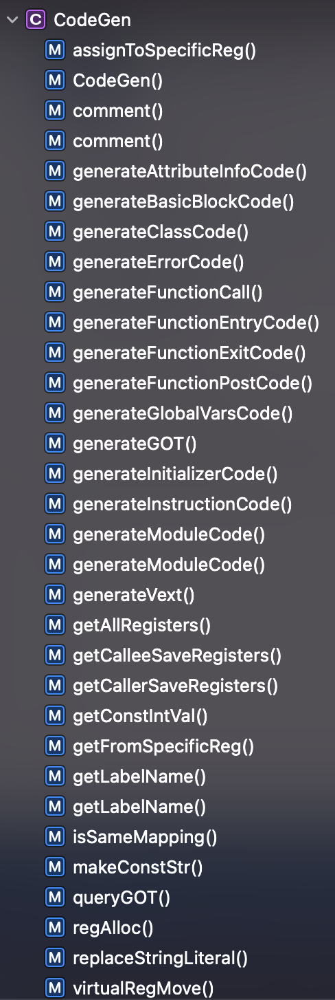

# Programing Assignment IV 文档

<!-- TOC -->

- [Programing Assignment IV 文档](#programing-assignment-iv-文档)
  - [0. 基础知识](#0-基础知识)
    - [0.1 标准库](#01-标准库)
    - [0.2 RISCV Spec](#02-riscv-spec)
    - [0.3 后端介绍](#03-后端介绍)
      - [0.3.1 对寄存器和地址的抽象](#031-对寄存器和地址的抽象)
      - [0.3.2 访存](#032-访存)
        - [0.3.2.1 寻址模式](#0321-寻址模式)
      - [0.3.3 寄存器分配](#033-寄存器分配)
      - [0.3.4 矢量拓展](#034-矢量拓展)
    - [0.4 内存管理](#04-内存管理)
  - [1. 实验要求](#1-实验要求)
    - [1.1 代码结构](#11-代码结构)
    - [1.2 主要工作](#12-主要工作)
    - [1.3 编译、运行和验证](#13-编译运行和验证)
    - [1.4 Bonus](#14-bonus)
    - [1.5 评分](#15-评分)

<!-- /TOC -->

在 CodeGen 中，我们需要从 Light IR 生成后端代码，LLVM IR 仅需要简单的转换指令、函数调用指定和寄存器分配就可以了。这也是为什么LLVM IR这么风靡的原因，很简单的对任意体系结构的代码生成。LLVM自己的实现可以参考[源码这里](https://github.com/llvm-mirror/llvm/blob/master/include/llvm/IR/IntrinsicsRISCV.t).

## 0. 基础知识
后端一般需要实现三个部分：

1. 指令选择
2. 指令调度
3. 寄存器分配
### 0.1 标准库
定义详见 [docs/common/stdlib](../../docs/common/stdlib.md)，调用时只需要寄存器状态对， `call [func]` 即可。
### 0.2 RISCV Spec
定义详见 [RISCV Spec](https://riscv.org/technical/specifications/)， [RVV](https://github.com/riscv/riscv-v-spec).

### 0.3 后端介绍

#### 0.3.1 对寄存器和地址的抽象
值的地址。
```c++
class Value {
public:
    virtual constexpr bool is_reg() const = 0;
    virtual constexpr bool is_constant() const = 0;
    virtual constexpr bool has_shift() const = 0;
    virtual constexpr string_view get_name() const = 0;
};
```
对寄存器的抽象
```c++
class Reg : public Value {
    int id;
public:
    explicit Reg(int id) : id(id) {
        if (id < 0 || id > max_reg_id) {
            LOG(ERROR) << "Invalid Reg ID!";
            abort();
        }
    }
    bool is_reg() const override { return true; }
    bool is_constant() const override { return false; }
    bool has_shift() const override { return false; }
    int getID() const { return this->id; }
    string_view get_name() const override { return reg_name[id]; }
    constexpr bool operator<(const Reg &rhs) const { return this->id < rhs.id; }
    constexpr bool operator==(const Reg &rhs) const { return this->id == rhs.id; }
    constexpr bool operator!=(const Reg &rhs) const { return this->id != rhs.id; }
};
class RegShift : public Value {
public:
    enum ShiftType { lsl, lsr, asl, asr };
private:
    int id;
    int shift;
    ShiftType _t;
}
```
callee \& caller saved \& temporary \&& general register
```c++
const vector<InstGen::Reg> caller_save_regs =
  {InstGen::Reg(1),  InstGen::Reg(5),  
  InstGen::Reg(6),  InstGen::Reg(7),
  InstGen::Reg(10), InstGen::Reg(11), 
  InstGen::Reg(12), InstGen::Reg(13),
  InstGen::Reg(14), InstGen::Reg(15), 
  InstGen::Reg(16), InstGen::Reg(17),
  InstGen::Reg(28), InstGen::Reg(29),
  InstGen::Reg(30), InstGen::Reg(31)};
const vector<InstGen::Reg> callee_save_regs = 
  {InstGen::Reg(2),  InstGen::Reg(8),
  InstGen::Reg(9),  InstGen::Reg(18),
  InstGen::Reg(19), InstGen::Reg(20), 
  InstGen::Reg(21), InstGen::Reg(22),
  InstGen::Reg(23), InstGen::Reg(24), 
  InstGen::Reg(25), InstGen::Reg(26),
  InstGen::Reg(27)};
const vector<InstGen::Reg> allocate_regs = 
  {InstGen::Reg(10), InstGen::Reg(11), 
  InstGen::Reg(12), InstGen::Reg(13),
  InstGen::Reg(14), InstGen::Reg(15), 
  InstGen::Reg(16), InstGen::Reg(17)};
const vector<InstGen::Reg> temp_regs = 
  {InstGen::Reg(5),  InstGen::Reg(6),  
  InstGen::Reg(7), InstGen::Reg(28),
  InstGen::Reg(29), InstGen::Reg(30), 
  InstGen::Reg(31)};
```
地址
```c++
class Addr {
    Reg reg;
    int offset;
    string str;
public:
    explicit Addr(Reg reg, int offset) : reg(std::move(reg)), offset(offset) {}
    Addr(string str) : str(std::move(str)), reg(Reg(0)), offset(0) {}
    Addr(string_view str) : str(str.begin(), str.end()), reg(Reg(0)), offset(0) {}
    Addr(const char *str) : str(str), reg(Reg(0)), offset(0) {}
    Reg getReg() const { return this->reg; }
    int getOffset() const { return this->offset; }
    string_view get_name() const;
};
```
一个名字的 Label
```c++
class Label {
    string label;
    int offset;
public:
    explicit Label(string label, int offset) : label(move(label)), offset(offset) {}
    explicit Label(string label) : label(move(label)), offset(0) {}
    string_view get_name() const { return fmt::format("{}+{}", label, offset); }
};
```
为了更快的访存，我们需要记录内存大小，L1，L2 cache大小，可以emit一些对空间局部性有好的代码，只需要符合stride在这三个数之内。


#### 0.3.2 访存
##### 0.3.2.1 寻址模式

以下是玄铁C910给出的可用寄存器，大部分为状态寄存器。


对于CISC机器来说，寻址有以下。注意前四种为基础寻址，后四种为scale寻址

| 类型   | AT&T语法格式   | 操作数值               | 名称               |
| ------ | -------------- | ---------------------- | ------------------ |
| 立即数 | \$ Imm         | Imm                    | 立即数寻址         |
| 立即数 | \$ Imm         | Imm                    | 立即数寻址         |
| 寄存器 | Ea             | R[Ea]                  | 寄存器寻址         |
| 存储器 | Imm            | M[Imm]                 | 绝对寻址           |
| 存储器 | (Ea)           | M[R[Ea]]               | 间接寻址           |
| 存储器 | Imm(Eb)        | M[Imm+R[Eb]]           | (基址+偏移量) 寻址 |
| 存储器 | (Eb, Ei)       | M[R[Eb]+R[Ei]]         | 变址寻址           |
| 存储器 | Imm(Eb, Ei)    | M[Imm+R[Eb]+R[Ei]]     | 变址寻址           |
| 存储器 | (, Ei, s)      | M[R[Ei] * s]           | 比例变址寻址       |
| 存储器 | Imm(, Ei, s)   | M[Imm+R[Ei] * s]       | 比例变址寻址       |
| 存储器 | (Eb, Ei, s)    | M[R[Eb]+R[Ei] * s]     | 比例变址寻址       |
| 存储器 | Imm(Eb, Ei, s) | M[Imm+R[Eb]+R[Ei] * s] | 比例变址寻址       |


对于riscv来说只有前四种寻址。分别对应addi a0, a0, imm/add a0,a0,a1/j a0/[jal && auipc+jalr](https://stackoverflow.com/questions/59150608/offset-address-for-jal-and-jalr-instrctions-in-risc-v)

其他的寻址可以通过多条指令操作数或[%hi() %lo()](https://stackoverflow.com/questions/62060724/address-offset-in-risc-v-load-instructions-hardcoded-or-not)来完成。玄铁C910新增了(基址+偏移量) 寻址 。

0.3.2.2 load/store

除了提供32位字(lw,sw)的加载和存储外，还有有符号和无符号字节和半字 (lb, lbu, lh. lhu) 和存储字节和半字 (sb, sh)。存符号字节和半字符号拓展为32位再写入目的寄存器。对于所有的类型没有歧视，公平对待。

0.3.2.3 vldx

对于任何一种体系结构，微体系结构内部带宽的优先供给一定是矢量寄存器。可以通过先把data从内存中取到矢量寄存器中，再从矢量寄存器load到目标寄存器。在x86中此过程为通过SSE寄存器的movnt或者通过AVX512寄存器的vmovntdq。在riscv中，此过程为vldx，需要注意的是，一般需要查询处理器的[各部分带宽](https://www.laruence.com/sse/)得到详细的cost model。

0.3.2.4 Global Offset Table([GOT](https://en.wikipedia.org/wiki/Global_Offset_Table))

为了更好的load一个常量，我们无法直接load，通常情况下，load可以寻找的内存地址跨度是有限的，需要跨很长的内存地址就需要先做内存松弛后再做跳转。如果仍然超出可寻址范围则需要多次寻址达到。这个过程在linker中经常会计算，因为链接多个文件到一个链接库需要跨GOT link可寻址的全局变量，详[见](https://maskray.me/blog/2021-08-29-all-about-global-offset-table)。在单文件中，也需要维护一个全局offset表，这样可以用任意四种寻址方式更快的找到label的地址。


#### 0.3.3 寄存器分配

Interface Graph图中的每个节点代表某个变量的活跃期或生存期（Live range）。活跃期定义是从变量第一次被定义（赋值）开始，到它下一次被赋值前的最后一次被使用为止。两个节点之间的边表示这两个变量活跃期因为生命期（lifetime）重叠导致互相冲突或干涉。一般说来，如果两个变量在函数的某一点是同时活跃（live）的，它们就相互冲突，不能占有同一个寄存器。本项目使用[图着色算法](https://web.eecs.umich.edu/~mahlke/courses/583f12/reading/chaitin82.pdf)，也可采用[线性扫描算法](https://www2.seas.gwu.edu/~hchoi/teaching/cs160d/linearscan.pdf)，以及偏向CISC指令集的[Second chance binpacking算法](https://www.zhihu.com/question/56005792/answer/147558407)。[SSA形式](http://citeseerx.ist.psu.edu/viewdocs/download?doi=10.1.1.162.2590&rep=rep1&type=pdf)带来的优点就是能有效的降低单个interval的长度，这在CISC指令集计算机中会非常有效。同时，充分利用SSA形式的IR的稀疏特性，避免迭代式的liveness analysis。有效的降低时间复杂度。

#### 0.3.4 矢量拓展

对于后端生成的矢量拓展来说，需要从extractelement开始使用vsetivli等状态寄存器标记再开始矢量拓展的生成，生成时只需pattern matching即可。可以[参考](https://github.com/riscv/riscv-v-spec/blob/master/example/vvaddint32.s)。

### 0.4 内存管理
在 lab4 中，所有编译后的ChocoPy程序将有$32\mathrm{MB}$的内存可以使用。在执行第一个顶层语句之前，寄存器gp将指向堆的起点。垃圾收集（GC）还没有在参考实现中实现；因此，新分配的对象会在程序的整个剩余时间内封锁空间。虽然堆和对象布局的设计使GC可以很容易实现，但我们不期望你在本作业中实现GC。自动评分器所使用的测试需要的内存远远少于$32\mathrm{MB}$来执行。
## 1. 实验要求

### 1.1 代码结构

详见[common/structure.md](./docs/common/structure.md)



CFG 走一遍主 函数 `generateMOduleCode` 就可以获得 Assembly, 其他函数被主函数调用。遍历所有可编译单元，Class->Func->Var->Instruction.同时需要维护GOT来得到label的位置，其余的指令按类型emit。
### 1.2 主要工作

1. 阅读[LLVM tablegen 相关文档](https://llvm.org/docs/TableGen/index.html)，如果不设计DSL该怎么设计后端。
2. 阅读[实验框架](#1-实验框架)，理解如何使用框架以及注意事项
3. 修改 [chocopy_cgen.cpp](../../src/cgen/chocopy_cgen.cpp) 来实现从 IR 到 riscv 汇编，使得它能正确编译任何合法的 ChocoPy 程序
4. 在 `README.md` 中解释你们的设计，遇到的困难和解决方案

### 1.3 编译、运行和验证

* 编译

  若编译成功，则将在 `./[build_dir]/` 下生成 `cgen` 和 `chocopy` 命令。

* 运行

  本次实验的 `cgen` 和 `chocopy` 命令使用命令行参数来完成编译和运行。

  ```shell
  $ cd chocopy
  $ ./build/cgen test.py -run # 直接用clang编译器编译到elf给qemu执行。
  $ ./build/cgen test.py -assem # 输出汇编。
  $ ./build/chocopy test.py -O[0/1/2/3] -run # 自定义优化等级。
  <以上的选项可以同时使用>
  ```


* 验证

  本次试验测试案例较多，为此我们将这些测试分为两类：

    1. sample: 这部分测试均比较简单且单纯，适合开发时调试。
    2. fuzz: 由fuzzer生成的正确的python文件，此项不予开源。
    3. benchmark: 同学可以自行添加编译选项（添加Pass，可以默认添加 `-O0`, `-O1`, `-O2`, `-O3`）对应不同的 passes.
    4. student: 这部分由同学提供。

  我们使用添加RVV1.0 extension `qemu-riscv32`
  
  ```shell
  $ python3 ./duipai.py --pa 4
  # 如果结果完全正确，则全 PASS，且有分数提示，一个正确的case 1 pts，此项评分按比例算入总评。选择chocopy的同学会在project部分分数上*1.2计入总评。
  # 如果有不一致，则会汇报具体哪个文件哪部分不一致，且有详细输出。
  ```

  我们使用python中的 `diffutil` 工具进行验证。将自己的生成结果和助教提供的 `xxx.typed.ast.result` 进行比较。

  **请注意助教提供的`testcase`并不能涵盖全部的测试情况，完成此部分仅能拿到基础分，请自行设计自己的`testcase`进行测试。**


### 1.4 Bonus
- 考虑 L1/L2 Size 的代码生成 [10 pts]
  - Gemm Benchmark 加速比提升 1.5 倍以上。
- 指令调度策略 [20 pts]
  - 通过重排指令顺序避免指令流水线停顿
  - 避免非法或语义模糊的操作（涉及典型的细微的指令流水线时序问题或非互锁的资源）
  - 对load/store/li 常量有指令选择
- 线性扫描寄存器分配 [10 pts]
### 1.5 评分

1. 基本测试样例[80 * 3/4 pts]
2. Fuzzer 测试[5 pts]
3. Student 测试[5 pts]
4. Benchmark 测试[15 pts]
5. 提供TestCase[5 pts]
6. 报告[10 pts]
