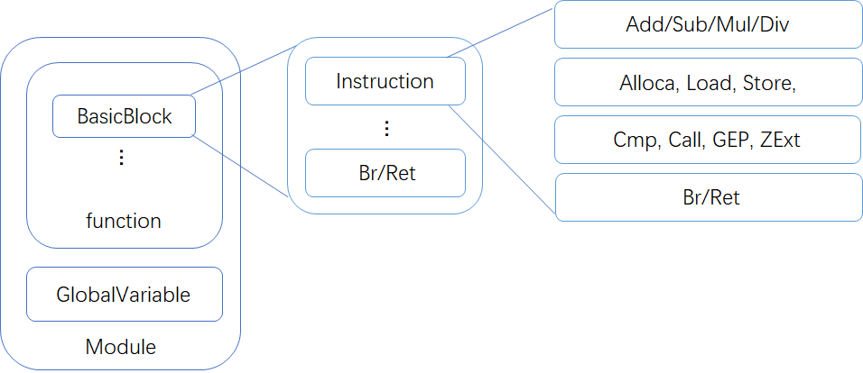

# Light IR

<!-- TOC -->

- [Light IR](#light-ir)
  - [LightIR](#lightir)
    - [IR Features](#ir-features)
    - [IR Format](#ir-format)
    - [Instruction](#instruction)
      - [Terminator Instructions](#terminator-instructions)
        - [Ret](#ret)
        - [Br](#br)
      - [Standard binary operators](#standard-binary-operators)
        - [Add](#add)
        - [Sub](#sub)
        - [Mul](#mul)
        - [Div](#div)
      - [Memory operators](#memory-operators)
        - [Alloca](#alloca)
        - [Load](#load)
        - [Store](#store)
      - [CastInst](#castinst)
        - [ZExt](#zext)
        - [Trunc](#trunc)
      - [Riscv VExt](#riscv-vext)
        - [Vstore](#vstore)
        - [Vload](#vload)
      - [Other operators](#other-operators)
        - [ICmp](#icmp)
        - [Call](#call)
        - [GetElementPtr](#getelementptr)
  - [C++ APIs](#c-apis)
    - [核心类概念图](#核心类概念图)
    - [BasicBlock](#basicblock)
    - [Constant](#constant)
    - [Function](#function)
    - [GlobalVariable](#globalvariable)
    - [IRBuilder](#irbuilder)
    - [Instruction](#instruction-1)
    - [Module](#module)
    - [Type](#type)
    - [User](#user)
    - [Value](#value)
    - [Class](#class)
    - [总结](#总结)

<!-- /TOC -->

## LightIR

我们在lab3中间将会使用一个精简定义的LLVM IR，其输出与 LLVM IR 兼容，可以被 clang 编译到`.o`文件再与链接器链接到可以在riscv机器上运行的程序。`.ll` 文件的验证可以通过 [Godbolt](https://godbolt.org/z/qcMhaYeca). 以下是简单定义，更详细的语意见[官网](https://llvm.org/docs/LangRef.html) 。

### IR Features

- 采用 3 地址的方式
    - 区别于 X86 汇编的目标和源寄存器共用的模式： ADD EAX, EBX
    - %2 = add i32 %0, %1
- SSA 形式 + 无限寄存器
    - 每个变量都只被赋值一次
    - 容易确定操作间的依赖关系，便于优化分析
- 强类型系统
    - 每个 Value 都具备自身的类型，
    - IR类型系统：
        - `i1`：1位宽的整数类型
        - `i8`：8位宽的整数类型, `i8*`用于表示 `str` 类型
        - `i32`：32位宽的整数类型
        - `pointer`：指针类型
            - 例如：`i32*, [10 x i32*]`
        - `label` bb的标识符类型
        - `functiontype`函数类型，包括函数返回值类型与参数类型（下述文档未提及）

### IR Format

以下面的`easy.c`与`easy.ll`为例进行说明。  
通过命令`clang -S -emit-llvm easy.c`可以得到对应的`easy.ll`如下（助教增加了额外的注释）。`.ll`文件中注释以`;`开头。

- `easy.c`:
  ``` c
  int main(){
    int a;
    int b;
    a = 1;
    b = 2;
    if(a < b)
      b = 3;
    return a + b;
  }
  ```
- `easy.ll`:
  ``` c
  ; 注释: .ll文件中注释以';'开头
  ; ModuleID = 'easy.c'                                
  source_filename = "easy.c"  
  ; 注释: target的开始
  target datalayout = "e-m:e-p270:32:32-p271:32:32-p272:64:64-i64:64-f80:128-n8:16:32:64-S128"
  target triple = "riscv32-unknown-linux-gnu"
  ; 注释: target的结束
  
  ; 注释: 全局main函数的定义
  ; Function Attrs: noinline nounwind optnone uwtable
  define dso_local i32 @main() #0 {
  ; 注释: 第一个基本块的开始
    %1 = alloca i32, align 4
    %2 = alloca i32, align 4
    %3 = alloca i32, align 4
    store i32 0, i32* %1, align 4
    store i32 1, i32* %2, align 4
    store i32 2, i32* %3, align 4
    %4 = load i32, i32* %2, align 4
    %5 = load i32, i32* %3, align 4
    %6 = icmp slt i32 %4, %5
    br i1 %6, label %7, label %8
  ; 注释: 第一个基本块的结束

  ; 注释: 第二个基本块的开始
  7:                                                ; preds = %0
    store i32 3, i32* %3, align 4
    br label %8
  ; 注释: 第二个基本块的结束
  
  ; 注释: 第三个基本块的开始
  8:                                                ; preds = %7, %0
    %9 = load i32, i32* %2, align 4
    %10 = load i32, i32* %3, align 4
    %11 = add nsw i32 %9, %10
    ret i32 %11                                     ; 注释: 返回语句
  ; 注释: 第三个基本块的结束
  }
  
  attributes_ #0 = { noinline nounwind optnone uwtable "correctly-rounded-divide-sqrt-fp-math"="false" "disable-tail-calls"="false" "frame-pointer"="all" "less-precise-fpmad"="false" "min-legal-vector-width"="0" "no-infs-fp-math"="false" "no-jump-tables"="false" "no-nans-fp-math"="false" "no-signed-zeros-fp-math"="false" "no-trapping-math"="false" "stack-protector-buffer-size"="8" "target-cpu"="x86-64" "target-features"="+cx8,+fxsr,+mmx,+sse,+sse2,+x87" "unsafe-fp-math"="false" "use-soft-float"="false" }
  
  !llvm.module.flags = !{!0}
  !llvm.ident = !{!1}
  
  !0 = !{i32 1, !"wchar_size", i32 4}
  !1 = !{!"clang version 10.0.1 "}
  ```

其中，每个program由1个或多个module组成，module之间由LLVM Linker合并。  
每个module组成如下：

- Target Information：
  ``` c
  target datalayout = "e-m:e-p270:32:32-p271:32:32-p272:64:64-i64:64-f80:128-n8:16:32:64-S128"
  target triple = "riscv32-unknown-linux-gnu"
  ```
- Global Symbols: main函数的定义
- Others:尾部其他信息

每个函数的组成如下：

- 头部：函数返回值类型，函数名，函数参数
- 一个或多个基本块：
    - 每个基本块又有Label和Instruction组成。
      ``` c
      8:                                                ; preds = %7, %0
        %9 = load i32, i32* %2, align 4
        %10 = load i32, i32* %3, align 4
        %11 = add nsw i32 %9, %10
        ret i32 %11  
      ```
      这个例子中，`8`就是Label。  
      `%9 = load i32, i32* %2, align 4`中的`%9`是目的操作数，`load`是指令助记符，`i32`是`int32`的类型，`i32*`是指向`int32`的地址类型，`%2`
      是源操作数，`align 4`表示对齐。

### Instruction

#### Terminator Instructions

**注**：ret与br都是Terminator Instructions也就是终止指令，在llvm基本块的定义里，基本块是单进单出的，因此只能有一条终止指令（ret或br）。当一个基本块有两条终止指令，clang
在做解析会认为第一个终结指令是此基本块的结束，并会开启一个新的匿名的基本块（并占用了下一个编号）。

##### Ret

- 概念：` ret`指令用于将控制流（以及可选的值）从函数返回给调用者。`ret`指令有两种形式：一种返回值，然后终结函数，另一种仅终结函数。
- 格式
    - `ret <type> <value>`
    - `ret void`

- 例子：
    - `ret i32 %0`
    - `ret void`

##### Br

- 概念：`br`指令用于使控制流转移到当前功能中的另一个基本块。 该指令有两种形式，分别对应于条件分支和无条件分支。
- 格式：
    - `br i1 <cond>, label <iftrue>, label <iffalse>`
    - `br label <dest>`
- 例子：
    - `br i1 %cond label %truebb label %falsebb`
    - `br label %bb`

#### Standard binary operators

##### Add

- 概念：`add`指令返回其两个`i32`类型的操作数之和，返回值为`i32`类型，`fadd`指令返回其两个`float`类型的操作数之和，返回值为`float`类型
- 格式：
    - `<result> = add <type> <op1>, <op2>`
- 例子：
    - `%2 = add i32 %1, %0`

##### Sub

- 概念：`sub`指令返回其两个`i32`类型的操作数之差，返回值为`i32`类型，`fsub`指令返回其两个`float`类型的操作数之差，返回值为`float`类型
- 格式与例子与`add`类似

##### Mul

- 概念：`mul`指令返回其两个`i32`类型的操作数之积，返回值为`i32`类型，`fmul`指令返回其两个`float`类型的操作数之积，返回值为`float`类型
- 格式与例子与`add`类似

##### Div

- 概念：`div`指令返回其两个`i32`类型的操作数之商，返回值为`i32`类型，`fdiv`指令返回其两个`float`类型的操作数之商，返回值为`float`类型
- 格式与例子与`add`类似

#### Memory operators

##### Alloca

- 概念： `alloca`指令在当前执行函数的堆栈帧上分配内存，当该函数返回其调用者时将自动释放该内存。 始终在地址空间中为数据布局中指示的分配资源分配对象
- 格式：`<result> = alloca <type>`
- 例子：
    - `%ptr = alloca i32`
    - `%ptr = alloca [10 x i32]`

##### Load

- 概念：`load`指令用于从内存中读取。
- 格式：`<result> = load <type>, <type>* <pointer>`
- 例子：`%val = load i32, i32* %ptr`

##### Store

- 概念：`store`指令用于写入内存
- 格式：`store <type> <value>, <type>* <pointer>`
- 例子：`store i32 3, i32* %ptr`

#### CastInst

##### ZExt

- 概念：`zext`指令将其操作数**零**扩展为`type2`类型。
- 格式：`<result> = zext <type> <value> to <type2>`
- 例子：`%1 = zext i1 %0 to i32`

##### Trunc

- 概念：`Trunc`指令将其操作数**零**压缩为`type2`类型。
- 格式：`<result> = trunc <type> <value> to <type2>`
- 例子：`%1 = trunc i32 %0 to i1`

#### Riscv VExt

##### Vstore

- 概念：`zext`指令将其操作数**零**扩展为`type2`类型。
- 格式：`<result> = zext <type> <value> to <type2>`
- 例子：`%1 = zext i1 %0 to i32`

##### Vload

- 概念：`Trunc`指令将其操作数**零**压缩为`type2`类型。
- 格式：`<result> = trunc <type> <value> to <type2>`
- 例子：`%1 = trunc i32 %0 to i1`

#### Other operators

##### ICmp

- 概念：`icmp`指令根据两个整数的比较返回布尔值。
- 格式：
    - `<result> = icmp <cond> <type> <op1>, <op2>`
        - `<cond> = eq | ne | sgt | sge | slt | sle`
- 例子：`i1 %2 = icmp sge i32 %0, %1`

##### Call

- 概念：`call`指令用于使控制流转移到指定的函数，其传入参数绑定到指定的值。 在被调用函数中执行`ret`指令后，控制流程将在函数调用后继续执行该指令，并且该函数的返回值绑定到`result`参数。
- 格式：
    - `<result> = call <return ty> <func name>(<function args>) `
- 例子：
    - `%0 = call i32 @func( i32 %1, i32* %0)`
    - `call @func( i32 %arg)`

##### GetElementPtr

- 概念：`getelementptr`指令用于获取数组结构的元素的地址。
  它仅执行地址计算，并且不访问内存。本条指令可以[参考](https://blog.yossarian.net/2020/09/19/LLVMs-getelementptr-by-example) 。
- 格式：`<result> = getelementptr <type>, <type>* <ptrval> [, <type> <idx>]`
- 参数解释：第一个参数是计算基础类型，第二第三个参数表示索引开始的指针类型及指针，`[]`表示可重复参数，里面表示的数组索引的偏移类型及偏移值。（Question：思考指针类型为`[10 x i32]`指针和`i32`
  指针`getelementptr`用法的不同，并给出解释，实验结束后回答两者使用情况的区别）
- 例子：
    - `%2 = getelementptr [10 x i32], [10 x i32]* %1, i32 0, i32 %0`
    - `%2 = getelementptr i32, i32* %1 i32 %0`

## C++ APIs

### 核心类概念图



### BasicBlock

- 含义：基本块，是一个是单入单出的代码块，该类维护了一个指令链表，基本块本身属于 Value, 类型是 \<label\>，会被分支指令调用

- 成员：

    - instr_list_：指令链表
    - pre_basic_blocks_： bb前驱集合
    - succ_basic_blocks_：bb后继集合

- API:

  ```c++
  static BasicBlock *create(Module *m, const std::string &name , Function *parent )
  // 创建并返回BB块，参数分别是BB块所属的Module，name是其名字默认为空，BB块所属的Function
  Function *get_parent();
  // 返回BB块所属的函数
  Module *get_module();
  // 返回BB块所属的Module
  Instruction *get_terminator();
  // 返回BB块的终止指令(ret|br)若BB块最后一条指令不是终止指令返回null
  void add_instruction(Instruction *instr);
  // 将instr指令添加到此BB块指令链表结尾，调用IRBuilder里来创建函数会自动调用此方法
  void add_instr_begin(Instruction *instr);
  // 将instr指令添加到此BB块指令链表开头
  void delete_instr(Instruction *instr);
  // 将instr指令从BB块指令链表中移除，同时调用api维护好instr的操作数的use链表。
  bool empty();
  // BB块中为空返回true
  int get_num_of_instr();
  // 返回BB块中指令的数目
  std::list<Instruction *> &get_instructions();
  //返回BB块的指令链表
  void erase_from_parent();
  // 将此BB块从所属函数的bb链表中移除
      
  /****************api about cfg****************/
  std::list<BasicBlock *> &get_pre_basic_blocks() // 返回前驱快集合
  std::list<BasicBlock *> &get_succ_basic_blocks() // 返回后继块集合
  void add_pre_basic_block(BasicBlock *bb) // 添加前驱块
  void add_succ_basic_block(BasicBlock *bb) // 添加后继块
  void remove_pre_basic_block(BasicBlock *bb) // 移除前驱块
  void remove_succ_basic_block(BasicBlock *bb) // 移除后继块
  /****************api about cfg****************/
  
  ```

### Constant

- 继承：User
- 含义：常数，各种类型常量的基类
- 子类：
    - ConstantInt：
        - 含义：int类型的常数

        - 成员：

            - val_：常数值

        - API：

          ```cpp
          int get_value() // 返回该常数类型中存的常数值
          static int get_value(ConstantInt *const_val)// 返回该常数类型const_val中存的常数值
          static ConstantInt *get(int val, Module *m) // 以val值来创建常数类
          static ConstantInt *get(bool val, Module *m) // 以val值来创建bool常数类
          ```

    - ConstantStr:
        - 含义：i8*类型的常数

        - 成员：

            - val_：常数值

        - API：

          ```cpp
          static ConstantStr *get(string val, Module *m) // 以val值创建并返回i8*数常量类
          float get_value() // 返回该常数类型中存的常数值
          ```

    - ConstantZero：

        - 含义：用于全局变量初始化的常量0值。

        - API：

          ```cpp
          static ConstantZero *get(Type *ty, Module *m);// 创建并返回ConstantZero常量类
          ```

    - ConstantArray

        - 含义：数组类型的常数
        - 成员：
            - const_array_：数组常量值

        - API：cminus语法不需要数组常量的支持（本次实验不需要用到），在此不过多解释。感兴趣可以自行查看源代码。

### Function

- 含义：函数，该类描述 LLVM 的一个简单过程，维护基本块表，格式化参数表

- 成员：
    - basic_blocks_：基本块列表
    - arguments_：形参列表
    - parent_：函数属于的module

- API：

  ```cpp
  static Function *create(FunctionType *ty, const std::string &name, Module *parent);
  // 创建并返回Function，参数依次是待创建函数类型ty，函数名字name(不可为空)，函数所属的Module
  FunctionType *get_function_type() const;
  // 返回此函数类的函数类型
  Type *get_return_type() const;
  // 返回此函数类型的返回值类型
  void add_basic_block(BasicBlock *bb);
  // 将bb添加至Function的bb链表上（调用bb里的创建函数时会自动调用此函数挂在function的bb链表上）
  unsigned get_num_of_args() const;
  // 得到函数形参数数量
  unsigned get_num_basic_blocks() const;
  // 得到函数基本块数量
  Module *get_parent() const;
  // 得到函数所属的Module
  std::list<Argument *>::iterator arg_begin() 
  // 得到函数形参的list的起始迭代器
  std::list<Argument *>::iterator arg_end() 
  // 得到函数形参的list的终止迭代器
  void remove(BasicBlock* bb) 
  // 从函数的bb链表中删除一个bb
  std::list<BasicBlock *> &get_basic_blocks() 
  // 返回函数bb链表
  std::list<Argument *> &get_args() 
  // 返回函数的形参链表
  void set_instr_name();
  // 给函数中未命名的基本块和指令命名
  ```


- 相关类：
    - Argument：
        - 含义：参数

        - 成员：
            - arg_no_：参数序号
            - parent_：参数属于哪个函数

        - API

          ```cpp
          Function *get_parent() // 返回参数的所属函数
          unsigned get_arg_no() const // 返回参数在所在函数的第几个参数
          ```

### GlobalVariable

- 含义：全局变量，该类用于表示全局变量，是 GlobalValue 的子类，根据地址来访问
- 成员：
    - is_const：是否为常量
    - init_val_：初始值
- API：由于chocopy语义要求所有的全局变量都默认初始化为需要的变量，故可以调用其初始化API，值得注意的是zerointializer的使用。

### IRBuilder

- 含义：生成IR的辅助类，该类提供了独立的接口创建各种 IR 指令，并将它们插入基本块中, 该辅助类不做任何类型检查。

- API：

  ```cpp
  BasicBlock *get_insert_block()// 返回正在插入指令的BB
  void set_insert_point(BasicBlock *bb)// 设置当前需要插入指令的bb
  Instruction *create_[instr_type]()// 创建instr_type(具体名字参考IRBuilder.h代码)的指令并对应插入到正在插入的BB块，这种类型的指令看函数名字和参数名字和IR文档是一一对应的。
  ```

### Instruction

- 继承：从User继承
- 含义：指令，该类是所有 LLVM 指令的基类，主要维护指令的操作码（指令类别），指令所属的基本块，指令的操作数个数信息
- 成员：
    - parent_：指令所属的BasicBlock
    - op_id_：指令的类型id
    - num_ops_指令的操作数个数
- 子类：
    - BinaryInst：双目运算指令包括add、sub、mul、div
    - 其他子类和前述文档中提到的指令一一对应，不在此赘述。
- API：所有指令的创建都要通过IRBuilder进行，不需要关注Instruction类的实现细节，（**注**：不通过IRBuilder来创建指令，而直接调用指令子类的创建方法未经助教完善的测试）

### Module

- 含义：一个编译单元，在此源语言的意义下是一个文件

- 成员：
    - function_list_：函数链表，记录了这个编译单元的所有函数
    - global_list_：全局变量链表
    - instr_id2string_：通过指令类型id得到其打印的string
    - module_name_, source_file_name：未使用
    - 从module中能取到的基本类型

- API：

  ```cpp
  Type *get_void_type(); 
  // 得到IR中的void类型其他类型可以用类似的API得到(推荐取得类型采用lab3助教提供的方法Type::get())
  void add_function(Function *f);
  // 将f挂在module的function链表上，在function被创建的时候会自动调用此方法来添加function
  void add_global_variable(GlobalVariable* g);
  // 将g挂在module的GlobalVariable链表上，在GlobalVariable被创建的时候会自动调用此方法来添加GlobalVariable
  std::list<GlobalVariable *> get_global_variable();
  // 获取全局变量列表
  std::string get_instr_op_name( Instruction::OpID instr )；
  // 获取instr对应的指令名(打印ir时调用)
  void set_print_name();
  // 设置打印ir的指令与bb名字；
  ```

### Type

- 含义：IR的类型，该类是所有类型的超类

- 成员：

    - tid_：枚举类型，表示type的类型（包含VoidType、LabelType、FloatType、Int1、Int32、ArrayType、PointerType）

- 子类：
    - IntegerType
        - 含义：int 类型

        - 成员：

            - num_bits：长度（i1或者i32）

        - API：

          ```cpp
          unsigned get_num_bits();// 返回int的位数
          ```
    - FloatType

        - 含义：float 类型
    - FunctionType
        - 含义：函数类型

        - 成员：
            - result_：返回值类型
            - args_：参数类型列表

        - API：

          ```cpp
          static FunctionType *get(Type *result, std::vector<Type*> params);
          // 返回函数类型，参数依次是返回值类型result，形参类型列表params
          unsigned get_num_of_args() const;
          // 返回形参个数
          Type *get_param_type(unsigned i) const;
          // 返回第i个形参的类型
          std::vector<Type *>::iterator param_begin() 
          // 返回形参类型列表的起始迭代器
          std::vector<Type *>::iterator param_end() 
          // 返回形参类型列表的终止迭代器    
          Type *get_return_type() const;
          // 返回函数类型中的返回值类型
          ```
    - ArrayType
        - 含义：数组类型

        - 成员：
            - contained_：数组成员的类型
            - num_elements_：数组维数

        - API：

          ```cpp
          static ArrayType *get(Type *contained, unsigned num_elements)
          // 返回数组类型，参数依次是 数组元素的类型contained，数组元素个数num_elements
          Type *get_element_type() const 
          // 返回数组元素类型
          unsigned get_num_of_elements() const
          // 返回数组元素个数
          ```
    - PointerType
        - 含义：指针类型

        - 成员：

            - contained_：指针指向的类型

        - API：

          ```cpp
          Type *get_element_type() const { return contained_; }
          // 返回指针指向的类型
          static PointerType *get(Type *contained);
          // 创建指向contained类型的指针类型
          Type *get_pointer_element_type()
          // 对于pointertype而言返回指针指向的类型，其他则返回nullptr
          ```

- API:

  ```cpp
  bool is_void_type()// 判断是否是void类型其他类型有类似API请查看Type.h
  static Type *get_void_type(Module *m);// 得到void类型
  Type *get_pointer_element_type();// 若是PointerType则返回指向的类型，若不是则返回nullptr。
  Type *get_array_element_type();// 若是ArrayType则返回指向的类型，若不是则返回nullptr。
  ```

### User

- 继承：从value继承

- 含义：使用者，提供一个操作数表，表中每个操作数都直接指向一个 Value, 提供了 use-def 信息，它本身是 Value 的子类， Value
  类会维护一个该数据使用者的列表，提供def-use信息。简单来说操作数表表示我用了谁，该数据使用者列表表示谁用了我。这两个表在后续的**优化实验**会比较重要请务必理解。

- 成员：
    - operands_：参数列表，表示这个使用者所用到的参数
    - num_ops_：表示该使用者使用的参数的个数

- API：

  ```cpp
  Value *get_operand(unsigned i) const;
  // 从user的操作数链表中取出第i个操作数
  void set_operand(unsigned i, Value *v);
  // 将user的第i个操作数设为v
  void add_operand(Value *v);
  // 将v挂到User的操作数链表上
  unsigned get_num_operand() const;
  // 得到操作数链表的大小
  void remove_use_of_ops();
  // 从User的操作数链表中的所有操作数处的use_list_ 移除该User;
  void remove_operands(int index1,int index2);
  // 移除操作数链表中索引为index1-index2的操作数，例如想删除第0个操作数：remove_operands(0,0)
  ```

### Value

- 含义：最基础的类，代表一个操作数，代表一个可能用于指令操作数的带类型数据

- 成员：
    - use_list_：记录了所有使用该操作数的指令的列表
    - class_name_：名字
    - type_：类型，一个type类，表示操作数的类型

- API：

  ```cpp
  Type *get_type() const //返回这个操作数的类型
  std::list<Use> &get_use_list() // 返回value的使用者链表
  void add_use(Value *val, unsigned arg_no = 0);
  // 添加val至this的使用者链表上
  void replace_all_use_with(Value *new_val);
  // 将this在所有的地方用new_val替代，并且维护好use_def与def_use链表
  void remove_use(Value *val);
  // 将val从this的use_list_中移除
  ```

### Class

-
含义：用于表征Class的类，继承语义参考[LLVM-C++实现](https://mapping-high-level-constructs-to-llvm-ir.readthedocs.io/en/latest/object-oriented-constructs/multiple-inheritance.html)
。

- 成员：
    - type_tag_：记录了所有使用该操作数的指令的列表
    - prototype_label_：记录本class prototype存放的地址
    - attributes_：ProtoType Table，用于记录这个类所有成员变量，同时存放被继承类的变量。
    - dispatch_table_label_：记录本class attribute存放的地址
    - methods_： Dispatch Table table，一个type类，用于存放这个Class已有的实现和override被继承类的虚函数指针。

- API：

  ```cpp
  void add_attribute(AttrInfo *attrInfo) const; //添加一个attribute
  void add_method(Func *method_) const; //添加一个attribute
  int get_size(); // 返回attrubutes的size，但不是prototype的第二个参数，需要get_size()/4+3。
  string get_string(); //返回class的名字。
  vector<Function *> *get_method() const;
  vector<AttrInfo *> *get_attribute() const;
  int get_attr_offset(string_view attribute) const;
  // 返回attribute的相对位置，相当于stdlib中的distance。
  ```

### 总结

助教在接口文档里筛选了可能会需要用到的接口，如果对API有问题的请移步issue讨论，本次`lightir`接口由助教自行设计实现，并做了大量测试，如有对助教的实现方法有异议或者建议的也请移步issue讨论，

**请碰到问题直接修改代码，尤其是GEP部分，如果觉得其他同学需要你的代码，请提交PR**。

**注**：由于`PA3 bonus`需要直接修改`ir`结构，为了方便同学们实现，助教将大部分私有变量(例如指令链表等)直接返回引用，请注意自己对私有变量的修改。