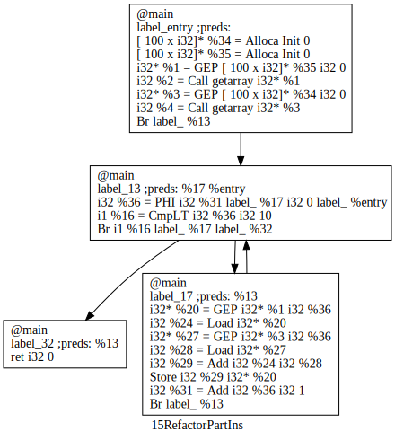
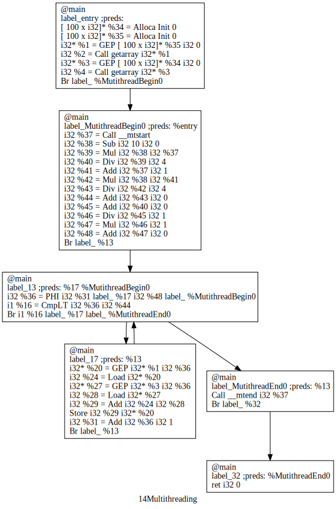

# ChocoPy stdlib

<!-- TOC -->

- [ChocoPy stdlib](#chocopy-stdlib)
  - [Assembler 定义](#assembler-定义)
    - [.equiv](#equiv)
    - [.word](#word)
    - [.align](#align)
    - [.string](#string)
    - [.space](#space)
    - [初始化全局变量定义](#初始化全局变量定义)
  - [内存管理](#内存管理)
    - [程序启动时 init heap](#程序启动时-init-heap)
    - [alloc/alloc2](#allocalloc2)
  - [IO](#io)
    - [input](#input)
    - [print](#print)
  - [int/bool](#intbool)
    - [makeint/bool](#makeintbool)
  - [list](#list)
    - [conslist](#conslist)
    - [len](#len)
  - [str](#str)
    - [makestr](#makestr)
    - [len](#len-1)
  - [class](#class)
    - [`object.__init__`](#object__init__)
  - [Error](#error)
  - [Bonus Part](#bonus-part)
    - [多线程部分](#多线程部分)
      - [find](#find)
      - [wrap](#wrap)
      - [accstart](#accstart)
      - [accend](#accend)


<!-- /TOC -->

由于需要设计中间层 Light IR，不能将其定义在 ChocoPy 源代码中，而位于[stdlib](../../src/cgen/stdlib/)。需要抽象成能用 c calling convention 传参调用的函数。由于伯克利的跑在 Venus 上系统 abi 不一致，所以我额外设计了一套跑在 qemu 上的 stdlib。在编译时，riscv 编译器会先编译 stdlib 到静态链接库。

## Assembler 定义
### .equiv 
由于只有 RV32IMAC 和 Venus 才会使用 `.equiv` 做变量替换，当环境变量存在 `EMIT` 的时候 cgen 才会输出 `.equiv`。 
### .word
链接器会自己 resolve 出 word label 的地址，一般存放 int literal 和 pointer。
### .align
我们在数据段中增加了对指定字节对齐的支持。支持的语法是 .align $langle n\rangle$，它插入零值字节作为填充，使得下一个可用地址是 $2^{n}$ 的倍数。
### .string 
相当于 .ascii
### .space 
相当于 '\n' 的 ascii 码。
### 初始化全局变量定义
- const_0 bool false
- const_1 bool true
- const_2 string "Invalid argument"
- const_3 string "True"
- const_4 string "False"
- const_5 string "Out of memory"
- const_6 string "Operation on None"
- const_7 string "Division by zero"
- const_8 string "Index out of bounds"

## 内存管理
### 程序启动时 init heap
默认启动分配 `8192 << 16` 内存，call stdlib 中的 `heap.init`，即 32MB。venus 实现为在 `a0` 为 9 时 `ecall`，linux 实现为把寄存器放入 ``
### alloc/alloc2
通过系统调用向操作系统申请内存，返回申请好的内存。
## IO
### input
`myscanf` 会读取 stdin，并判断输入是 int/bool/str，自动 call 对应的初始化变量的函数，最终返回各自的 prototype。

### print

`myprintf` 会输出 stdout，并判断输出 int/bool/str type。

## int/bool
### makeint/bool
函数定义为 `%$int/bool$prototype_type* @makeint(i32)`，给一个 i32，返回一个创建好的 int prototype。实现需要 alloc 内存。
## list

### conslist
函数定义为 `%$.list$prototype_type* @conslist(i32, %$union.conslist, ...)`， `i32` 为元素个数，通过第二个参数判断是什么类型的 list，初始化对应 list。所有 list 都需动态 call conslist 来实现。对于没有穿参数或者 call intrinsic function 的数组会默认不需要 `conslist` 获得 prototype 从而提升性能。

### len
函数定义为 `i32 @$len(%$union.len*)`，可以接受 list 或 str 类型，读取 `__len__` attributes，返回 i32。

## str

### makestr
函数定义为 `%$str$prototype_type* @makestr(%i8*)` 输入 i8*，将其放入 `$str$prototype_type` 内。
### len
与 list 部分一致。

## class

### `object.__init__`
就是一个占位符。
## Error

会输出错误信息，并 call abort 退出程序，相当于 `exit(-1)`。
- Div 除0 error，输出 `const_7`
- None 除0 error，输出 `const_6`
- OOB 除0 error，输出 `const_8`

## Bonus Part
### 多线程部分
具体过程：find + wrap

#### find

find的条件很多，简而言之，找到每个最内循环的最外层循环，然后看能否`MultiThreading`化

这个外层循环应该满足的条件是：

* 需要一个start到end的递增模式
* 分支指令应该是`Br Lt i32 Const <Label1> <Label2>`的形式
* 不能有其他Phi指令（迷，这样就限制了只能有一个循环变量


以矩阵赋值的例子，br是根据 i 和 n 的大小关系

Phi的四个操作数

1. i、递增变量
2. BB1、递增 i 的BB
3. Constant、100，循环边界
4. BB2、%entry


累加值：

```c++
auto accuVal = dynamic_cast<ConstantInt *>(accu->getOperand(1));
```

#### wrap

包装部分：在循环的条件Block之前插入ACCstart，在更新迭代变量的之前插入ACCend

```c
while (i<n){
	A[i] = A[i]+B[i];
}
```

插入多线程部分之前



插入之后：

```llvm
%37: 多线程号 tid
%38: 问题规模 n
%40: _l = (n*tid)/4 
%43: _r = (n*(tid+1))/4
%44: _r + start		右边界
%48: (_l + step-1)/step * step + start		迭代变量初始值
```


```llvm
define @main()
<label>entry:   level=0   preds=   succs=(%13)
    REG 4    [ 100 x i32]* %34  = Alloca 
    REG 1    [ 100 x i32]* %35  = Alloca 
    REG 0    i32 %2  = Call getarray [ 100 x i32]* %35 
    REG 0    i32 %4  = Call getarray [ 100 x i32]* %34 
    REG 10    i32 %37  = Call accstart 
 MT REG 2    i32 %39  = Mul i32 10 i32 %37 
 MT REG 0    i32 %41  = Add i32 %37 i32 1 
 MT REG 0    i32 %42  = Mul i32 10 i32 %41 
 MT REG 5    i32 %50  = AShr i32 %42 i32 2 
 MT REG 0    i32 %51  = AShr i32 %39 i32 2 
 MT REG 0    i32 %52  = Shl i32 %51 i32 0 
 MT          Br <label> %13 
<label>13:   level=1   preds=(%17 %entry)   succs=(%17 %MutithreadEnd0)
 MT REG 0    i32 %36  = PHI i32 %31 <label> %17 i32 %52 <label> %entry 
 MT          Br LT i32 %36 i32 %50 <label> %17 <label> %MutithreadEnd0 
<label>17:   level=1   preds=(%13)   succs=(%13)
 MT REG 3    i32 %24  = Load [ 100 x i32]* %35 i32 %36 i32 2 
 MT REG 2    i32 %28  = Load [ 100 x i32]* %34 i32 %36 i32 2 
 MT REG 2    i32 %29  = Add i32 %24 i32 %28 
 MT          Store i32 %29 [ 100 x i32]* %35 i32 %36 i32 2 
 MT REG 0    i32 %31  = Add i32 %36 i32 1 
 MT          Br <label> %13 
<label>MutithreadEnd0:   level=0   preds=(%13)   succs=
             Call accend i32 %37 
             ret i32 0 
```


首先知道system call的约定

```bash
> man syscall 2
The first table lists the instruction used to transition to kernel
mode, the register used to indicate the system call number, the 
register used to return the sys‐tem call result, and the register 
used to signal an error.

arch/ABI    instruction           syscall #  retval  error    Notes
────────────────────────────────────────────────────────────────────
arc         trap0                 r8         r0      -
arm/OABI    swi NR                -          a1      -        [2]
arm/EABI    swi 0x0               r7         r0      -
arm64       svc #0                x8         x0      -
riscv       ecall                 a7         a0      a1        -

Note:
[2] NR is the system call number.

The second table shows the registers used to pass the system call
arguments.

arch/ABI      arg1  arg2  arg3  arg4  arg5  arg6  arg7  Notes
──────────────────────────────────────────────────────────────
arc           r0    r1    r2    r3    r4    r5    -
arm/OABI      a1    a2    a3    a4    v1    v2    v3
arm/EABI      r0    r1    r2    r3    r4    r5    r6
arm64         x0    x1    x2    x3    x4    x5    -
riscv         a0    a1    a2    a3    a4    a5    -
```

然后man clone 2

```c
int clone(int (*fn)(void *), void *stack, int flags, void *arg, ...
          /* pid_t *parent_tid, void *tls, pid_t *child_tid */ );
```

Linux对线程的设计：线程只不过是共享虚拟地址空间和文件描述符表的进程，定义上线程之间共享除寄存器、栈、线程内本地存储（thread-local storage, TLS）之外的所有东西。

操作系统和底层硬件天然地保证了线程不会共享寄存器，TLS 不是必须的，本项目又使得线程之间共享栈空间，所以几乎没有切换开销

clone跟fork都是创建子进程（线程），区别在于clone能更详细的定制子进程和父进程共享的内容：如虚拟内存地址空间，文件描述符表，the table of signal handlers

clone对父进程返回所创建的子进程的tid，如果失败，返回-1

`clone_flags`的长度为8个字节，减去发送给父进程的信号代码的一个字节后剩下了7个字节用于传递进程复制信息，即可以同时设置7*8=56个标志位，也就是可以同时控制24种进程信息的复制。要设置某个标志位时只需要将其对应的取值与`clone_flags`进行或运算即可：

为啥clone_flags是273

273的32位二进制是0000000100010001，十六进制0x0111

[linux 5.17 sched.h](https://elixir.bootlin.com/linux/v5.17/source/include/uapi/asm-generic/signal.h#L18)

```c
/*
 * cloning flags:
 */
#define CSIGNAL		0x000000ff	/* signal mask to be sent at exit */
#define CLONE_VM	0x00000100	/* set if VM shared between processes */
#define CLONE_FS	0x00000200	/* set if fs info shared between processes */
#define CLONE_FILES	0x00000400	/* set if open files shared between processes */
/*....*/
#define CLONE_NEWUSER		0x10000000	/* New user namespace */
#define CLONE_NEWPID		0x20000000	/* New pid namespace */
#define CLONE_NEWNET		0x40000000	/* New network namespace */
#define CLONE_IO		0x80000000	/* Clone io context */
```

在 [kernel/fork.c](https://elixir.bootlin.com/linux/v5.17/source/kernel/fork.c#L2502)

```c
/* ok, now we should be set up.. */
p->exit_signal = (clone_flags & CLONE_THREAD) ? -1 : (clone_flags & CSIGNAL);
p->pdeath_signal = 0;
p->exit_state = 0;
```

至于为啥最后两个数字是17

定义在 [include/uapi/asm-generic/signal.h](https://elixir.bootlin.com/linux/v5.17/source/include/uapi/asm-generic/signal.h#L18) 32个信号量

```c
#define SIGHUP		 1
#define SIGINT		 2
#define SIGQUIT		 3
#define SIGILL		 4
#define SIGTRAP		 5
#define SIGABRT		 6
#define SIGIOT		 6
#define SIGBUS		 7
#define SIGFPE		 8
#define SIGKILL		 9
#define SIGUSR1		10
#define SIGSEGV		11
#define SIGUSR2		12
#define SIGPIPE		13
#define SIGALRM		14
#define SIGTERM		15
#define SIGSTKFLT	16
#define SIGCHLD		17
//...
```


项目默认关闭多线程优化Pass

与经典框架 OpenMP 对比的优点

* 节约了栈开销：不需要将被并行化的区域拆分出来变成函数
* 节约了切换上下文：不需要保存上下文和维护各种信息
* 仅仅需要维护线程独有的寄存器
#### accstart

```llvm
# Runtime support function accstart
  mv fp, sp
  add t1, zero, zero
  lui t1, 1044480
  add sp, sp, t1
  add sp, sp, -12
  sw  a0, 0(sp)
  sw  a1, 4(sp)
  sw  a2, 8(sp)
  sw  a3, 12(sp)
  mv a3, a7
  addi a2, zero, 4
accstart_1:
  addi a2, a2, -1
  beqz a2, accstart_2
  addi a7, zero, 120
  addi a0, zero, 20
  mv a1, sp
  ecall
  bnez a0, accstart_1
accstart_2:
  mv tp, a2
  mv a7, a3
  lw  a0, 0(sp)
  lw  a1, 4(sp)
  lw  a2, 8(sp)
  lw  a3, 12(sp)
  add sp, sp, 12
  add s1, zero, zero
  lui s1, 4096
  add sp, sp, s1
  ret
```

#### accend

```llvm
# Runtime support function accend
  beqz s1, .accend_2
.accend_1:
  call exit
.accend_2:
  addi sp, sp, -16
  sw  a0, 0(sp)
  sw  a1, 4(sp)
  sw  a2, 8(sp)
  sw  a3, 12(sp)
  addi a1, zero, 4
.accend_3:
  addi a1, a1, -1
  beqz a1, .accend_4
  addi sp, sp, -8
  sw  a1, 0(sp)
  sw  ra, 4(sp)
  addi sp, sp, -4
  mv a0, sp
  jal wait
  addi sp, sp, 4
  lw  a1, 0(sp)
  lw  ra, 4(sp)
  addi sp, sp, 8
  j .accend_3
.accend_4:
  lw  a0, 0(sp)
  lw  a1, 4(sp)
  lw  a2, 8(sp)
  lw  a3, 12(sp)
  addi sp, sp, 16
  mv s1, zero
  ret
```